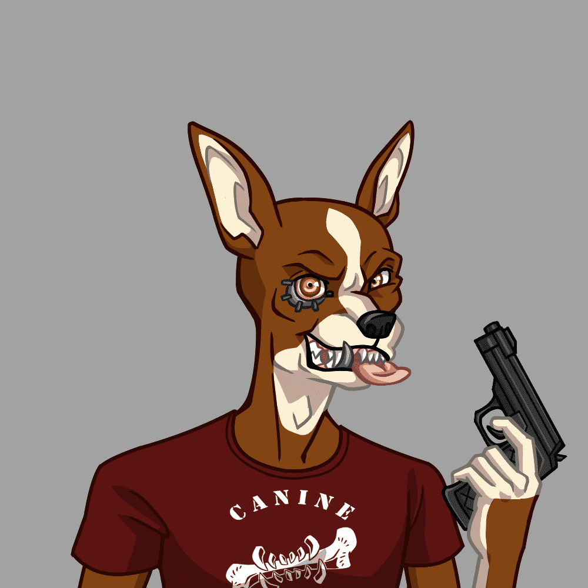

# CanineCartel

Canine Cartel 是由 10,000 只在这些街道上奔跑的最疯狂的杂种狗组成的包。 每个 Canine NFT 都是一个独特的 ERC-721 数字收藏品，存在于以太坊区块链上。 您的犬使您成为我们中的一员。 但是，请注意，我们是乘车或死亡的船员。 进去很简单，出去对身体不好。

CanineCartel 的总销售额为 25.32 美元。 一份 CanineCartel NFT 的平均价格为 12.7 美元。 有 4,351 名 CanineCartel 所有者，拥有 10,000 个代币的总供应量。

什么是 CanineCartel？
CanineCartel 是一个 NFT（不可替代令牌）集合。 存储在区块链上的数字艺术品集合。
▶ 存在多少 CanineCartel 代币？
总共有 10,000 个 CanineCartel NFT。 目前，4,351 位车主的钱包中至少有一个 CanineCartel NTF。
▶ 最昂贵的 CanineCartel 销售是什么？
售出的最昂贵的 CanineCartel NFT 是 Canine Cartel #1810。 它于 2022-08-18（14 天前）以 14.1 美元的价格售出。
▶ 最近卖出了多少 CanineCartel？
过去 30 天内售出了 8 个 CanineCartel NFT。
▶ 什么是流行的 CanineCartel 替代品？
许多拥有 CanineCartel NFT 的用户还拥有 Alien Punk Things、dadmfers、Deadhead Apes 和 CLAYPETS。

