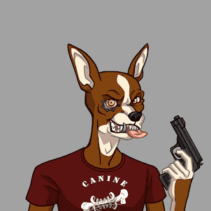

# Canines Cartel

.png)

每个 Canine NFT 都是一个独特的 ERC-721 数字收藏品，存在于以太坊区块链上。你的犬使你成为我们中的一员。但是，请注意，我们是乘车或死亡的船员。进去很简单，出去对身体不好

##### ▶ 什么是 CanineCartel？

CanineCartel 是一个 NFT（不可替代令牌）集合。存储在区块链上的数字艺术品集合。

##### ▶ 存在多少 CanineCartel 代币？

总共有 10,000 个 CanineCartel NFT。目前，4,351 位车主的钱包中至少有一个 CanineCartel NTF。

##### ▶ 最昂贵的 CanineCartel 销售是什么？

售出的最昂贵的 CanineCartel NFT 是 Canine Cartel #4776。它于 2022 年 8 月 1 日（29 天前）以 14.1 美元的价格售出。

##### ▶ 最近卖出了多少 CanineCartel？

过去 30 天内售出了 11 个 CanineCartel NFT。

##### ▶ CanineCartel 的费用是多少？

在过去 30 天里，最便宜的 CanineCartel NFT 销售额低于 6 美元，最高销售额超过 14 美元。在过去 30 天内，CanineCartel NFT 的中位价格为 9 美元。
