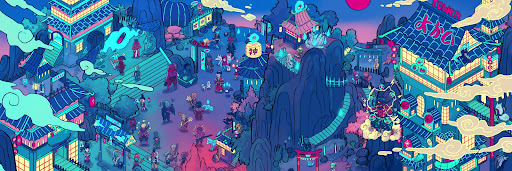
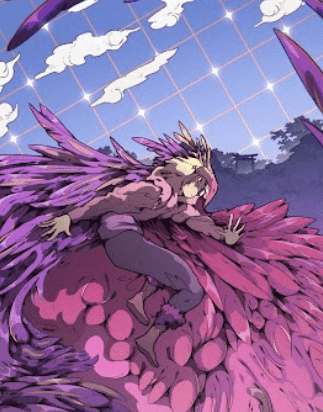

# Capsule Community Curated Collection

我们与 Capsule House Community Curated 合作的目标是让我们的持有者能够接触到才华横溢但常常被低估的艺术家。

##### ▶ 什么是 Capsule 社区精选系列？

Capsule Community Curated Collection 是一个 NFT（Non-fungible token）集合。存储在区块链上的数字艺术品集合。

##### ▶ 存在多少 Capsule Community Curated Collection 代币？

总共有 7 个 Capsule Community Curated Collection NFT。目前，1,137 位所有者的钱包中至少有一个 Capsule Community Curated Collection NTF。

##### ▶ 最昂贵的 Capsule Community Curated Collection 销售是什么？

最贵的 Capsule Community Curated Collection NFT 是 [Yokai Spirit Realm。它于 2022-06-07（3 个月前）以 68.9 美元的价格售出。

##### ▶ 最近卖出了多少 Capsule Community Curated Collection？

过去 30 天内共售出 11 个 Capsule Community Curated Collection NFT。

##### ▶ Capsule 社区策划的收藏需要多少钱？

过去 30 天，最便宜的 Capsule Community Curated Collection NFT 销售额低于 39 美元，最高销售额超过 66 美元。Capsule Community Curated Collection NFT 的中位价格在过去 30 天内为 43 美元。

**截止至8月30日**

7项目

1.1K拥有者

7.7总容积

0.02底价

<0.01最好的报价
