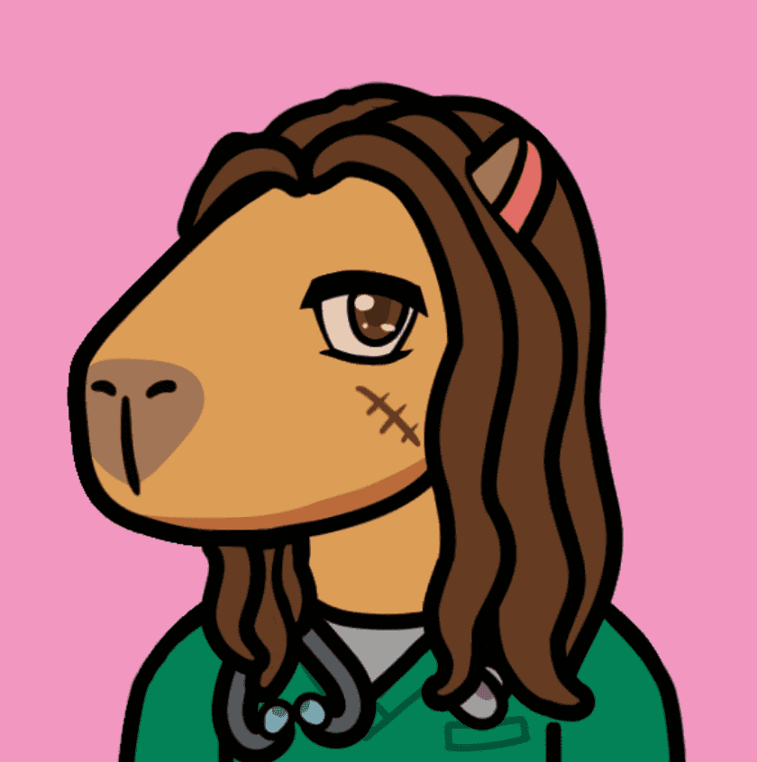

# Capybaras Country Club Official

一个完全动画的集合准备进入沙盒元节。 第一次在 The Sandbox 体验乡村俱乐部。

Capybaras Country Club Official 的总销售额为 39.08 美元。 Capybaras Country Club 官方 NFT 的平均价格为 7.8 美元。 Capybaras 乡村俱乐部官方拥有者 1,177 名，拥有总供应量 2,736 个代币。

什么是水豚乡村俱乐部官员？
Capybaras Country Club Official 是一个 NFT（不可替代代币）系列。存储在区块链上的数字艺术品集合。
▶ Capybaras Country Club 官方代币有多少？
总共有 2,736 个 Capybaras Country Club 官方 NFT。目前，1,177 位车主的钱包中至少有一个 Capybaras Country Club 官方 NTF。
▶ 最昂贵的水豚乡村俱乐部官方促销活动是什么？
Capybaras Country Club Official NFT 售出的最昂贵的是 Capybaras Country Club #564。它于 2022-06-05（3 个月前）以 36.4 美元的价格售出。
▶ 最近卖出了多少水豚乡村俱乐部官员？
过去 30 天内共售出 29 个 Capybaras Country Club 官方 NFT。
▶ 水豚乡村俱乐部官员的费用是多少？
过去 30 天，Capybaras Country Club 官方 NFT 最便宜的销售额低于 7 美元，最高销售额超过 22 美元。 Capybaras Country Club 官方 NFT 的中位价格在过去 30 天内为 11 美元。
▶ 有哪些流行的 Capybaras Country Club Official 替代品？
许多拥有 Capybaras Country Club Official NFT 的用户还拥有 Metaverse、Rainbow Cats NFT、rugimals 和 PaperHands Official 的 Role。

