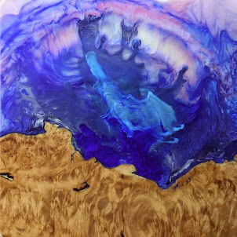
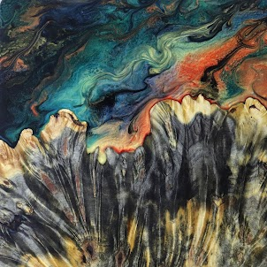

# Carved Tiles

##### ▶ 什么是雕刻瓷砖？

Carved Tiles 是一个 NFT（非同质代币）集合。存储在区块链上的数字艺术品集合。

##### ▶ 有多少雕刻瓷砖代币？

总共有 100 个 Carved Tiles NFT。目前，59 位业主的钱包中至少有一个 Carved Tiles NTF。

##### ▶ 最近卖出了多少块雕刻瓷砖？

过去 30 天内售出了 0 个 Carved Tiles NFT。

**截止至8月30日**

100**项目**

59**拥有者**

14.0**总容积**

0.3**底价**
