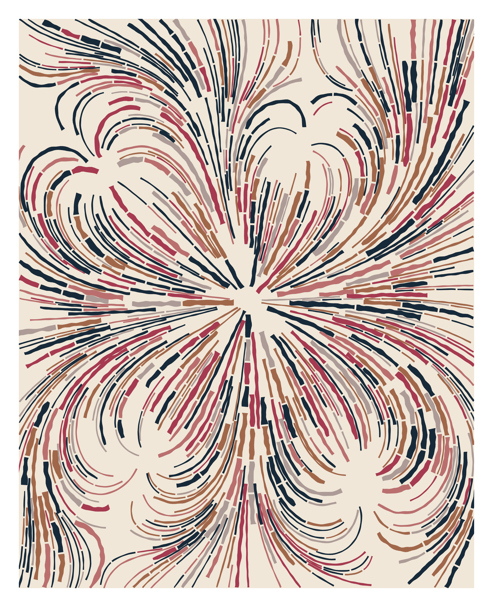

# Cascade by TinkRNG

TinkRNG 的 Cascade 是一个新颖的、受生物启发的生成艺术项目，描绘了人类蛋白质组中的模式。 每一块都代表一种独特的蛋白质，其特性来源于蛋白质的氨基酸序列、蛋白质定位的细胞区室以及蛋白质参与的主要生物过程。要了解更多信息，请阅读我们的白皮书 以及我们的第二个出版物。 我们的 Cascade Genesis 系列可以在 Opensea 以及最初拍卖的 Foundation 上找到。

我们是一个由三名工程师组成的团队，对科学与艺术交叉领域的建筑项目充满热情。TinkRNG代表了我们创建的母公司，其目标是利用我们对数学和分子生物学的理解来突出数十亿年进化中锻造的一些令人难以置信的，通常是隐藏的生命模式。

TinkRNG的Cascade是我们的第一个项目，旨在通过创建一种新颖的，受生物学启发的生成艺术算法来描绘人类蛋白质组的模式。我们收藏中的每件作品都代表一种独特的蛋白质，其特性来自信息，包括蛋白质的氨基酸序列，蛋白质定位的细胞区室以及蛋白质参与的主要生物过程。

