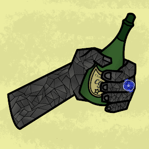

# Cash Grab NFT

Grabatars 是 5,609 个可组合的 NFT，由头部、Cash Grab 手臂和腿组成。将其中三个 NFT 带入 The Lab，收藏家能够组合多个 NFT 来创建独一无二的 Grabatar。一种围绕稀缺性创建的经济体，随着 Grabatars 的制作而被移除，直到所有 Grabatars 都被构建出来。加入我们并

.png)

##### ▶ 什么是 Cash Grab NFT？

Cash Grab NFT 是一个 NFT（不可替代代币）集合。存储在区块链上的数字艺术品集合。

##### ▶ Cash Grab NFT 代币有多少？

总共有 5,608 个 Cash Grab NFT NFT。目前，1,007 名所有者的钱包中至少有一个 Cash Grab NFT NTF。

##### ▶ 最近卖出了多少 Cash Grab NFT？

过去 30 天内售出 0 个 Cash Grab NFT NFT。

