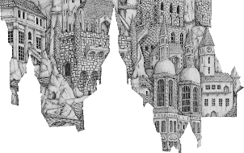

# CastleNFT Pieces

**第一个拼图 NFT 项目。我们已经制作了近 2 年制作的令人难以置信的艺术品，并将其分成 25 个拼图。谁将第一个收集全套？**

总共有 20k 件可供铸币厂使用，相当于 800 个完整的拼图。当您铸造时，您将收到完全随机的碎片，您甚至可能不止一次地获得相同的碎片。但别担心，这意味着你有一件别人需要的东西！您可以出售和交易您的双打，以尝试收集您需要的所有部件。

.png)

为了让事情更有趣，20k 件中有 4 种不同的稀有物品。黄金是最稀有的，仅占 800 个谜题中的 5 个。其次是银、铜和铁。

您可以同时收集多个稀有物品，并通过这个定制的网站跟踪您的作品。当您收集到任何给定稀有度的所有 25 个独特拼图时，您将能够将它们换成全分辨率城堡艺术品 NFT。随之而来的是您的专属俱乐部会员资格，为持有人提供福利。

但是要尽快收集它们，因为有一场比赛来制作第一个完整的谜题！

第一个为稀有物品组装完整拼图之一的人将获得：

**黄金 50K USDC         白银30K USDC           黄铜15K USDC      铁5K USDC**

我们期待看到动态的结果。你会以个人或团队的形式收集这些作品吗？你会卖掉你的双打还是给他们赎金？

狩猎快乐，祝你好运！！

