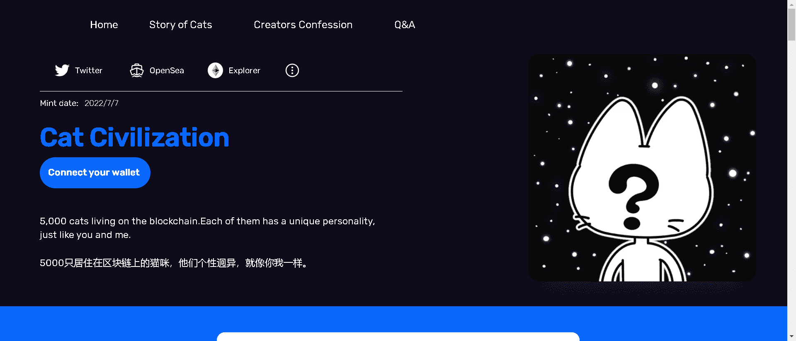

# Cat Civilization NFT

5000 只猫生活在区块链上。每只猫都有独特的个性，就像你我一样。

在猫文化中，对神的描述有多种版本。但几乎所有版本都倾向于认为上帝创造了世界并创造了猫作为所有精神的首领。猫坚信自己是被选中的存在。

没有路线图，没有白皮书，没有DC，只有创作者的自白。
猫文明是个人艺术创作的集合。创作者是一个没有团队、没有资本、不懂智能合约的人。
除涂装部分外，其他技术工作均使用第三方提供的无代码功能完成。

