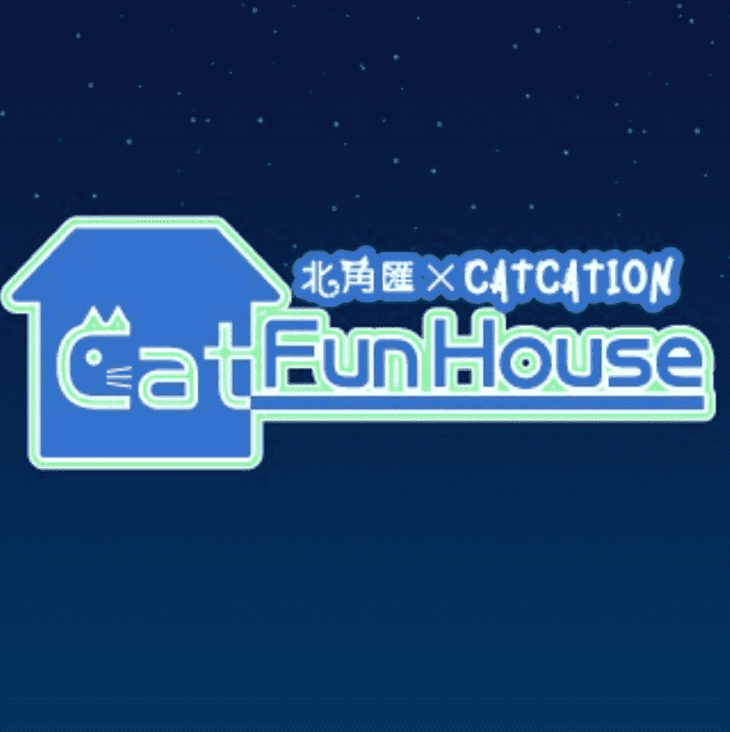

# CatArtMetaverse CatFunHouse

全港首间实体「Cat Fun House」，特设两大主题空间：「忍者猫道场」和「喵次元弹珠馆」，内有CAMERA-CAT动态影片摄录 -- 透过特定镜头，捕捉主子玩乐片段，并剪辑成黄金15秒，成为猫生首个NFT收藏品，盛载猫奴与主子独一无二的珍藏回忆。另外，Catcation特意邀请了香港歌手李卓庭为该次NFT背景音乐作曲，体现出猫咪活泼好动又带点调皮的一面以及与主人互动的愉快时光。

8月25日至10月9日期间，馆内将呈献300幅由香港创科团队CATCATION
以「喵咪宅度假」为主题之NFT艺术品，配以立体化场景、慈善竞投NFT喵画、
The Point会员尊享的【期间限定】Cat Fun House及有奖手机游戏等，
让你投入「喵」次元宇宙，「出游」日本看世界！

