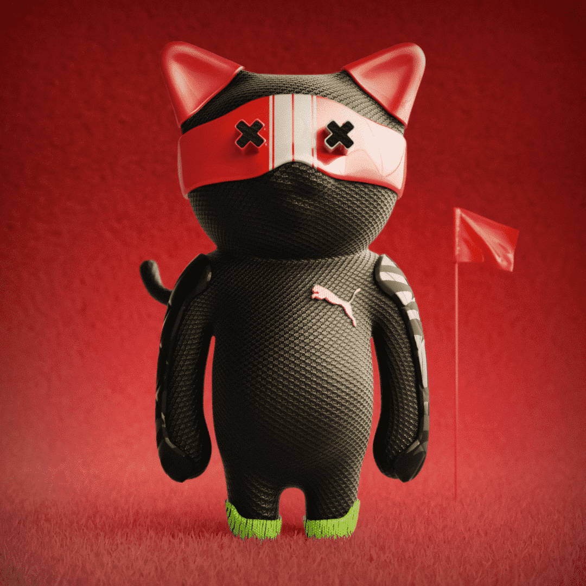

# CatBlox X PUMA Capsule

CatBlox x PUMA Capsule Collection 2,500 个 NFT 庆祝 PUMA 的标志性遗产和文化，包括由 KidSuper 创始人 Colm Dillane 共同设计的具有特征和视觉特征的稀有物品。Minters 可以将这些数字代币兑换成与其稀有等级相匹配的实体服装物品 NFT。 一位幸运铸币者将随机收到 1/1 稀有猫，让他们有权获得 1/1 原创 KidSuper 设计。 数字和实体物品均为此 Capsule Collection 独有，永远不会再次出售。此外，每个 NFT 都提供了进一步访问 PUMA 的 web3 未来体验和生态系统的机会，以及首次访问 KidSuper 即将推出的 Web3 活动。

