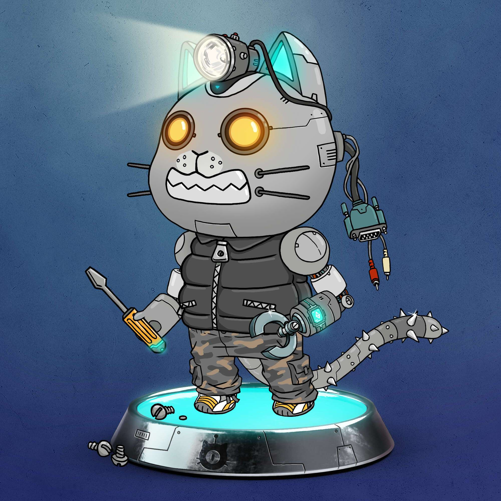

# Catbotica

CATBOTICA 是一个手绘的、生成的 pfp 项目，由以太坊区块链上的 12,000 个称为 Catbots 的二维资产组成，作为 ERC-721 标准不可替代代币 (NFT)。 这些 2D NFT 将授予对 Discord 中特殊通道的访问权限，使持有者有资格获得各种 NFT 空投，并解锁额外的 NFT 铸造功能，这些功能将在拟议的路线图中具有未来用途。

第一个CATBOTICA NFT集合，拥有来自Neilos星球的12，000个Catbots，现在居住在以太坊区块链上。

Nanocats [ NV1s / NV2s ] 分为两个发布阶段和品种，将允许用户创建和升级3D资产。也可以保留以供将来使用。

