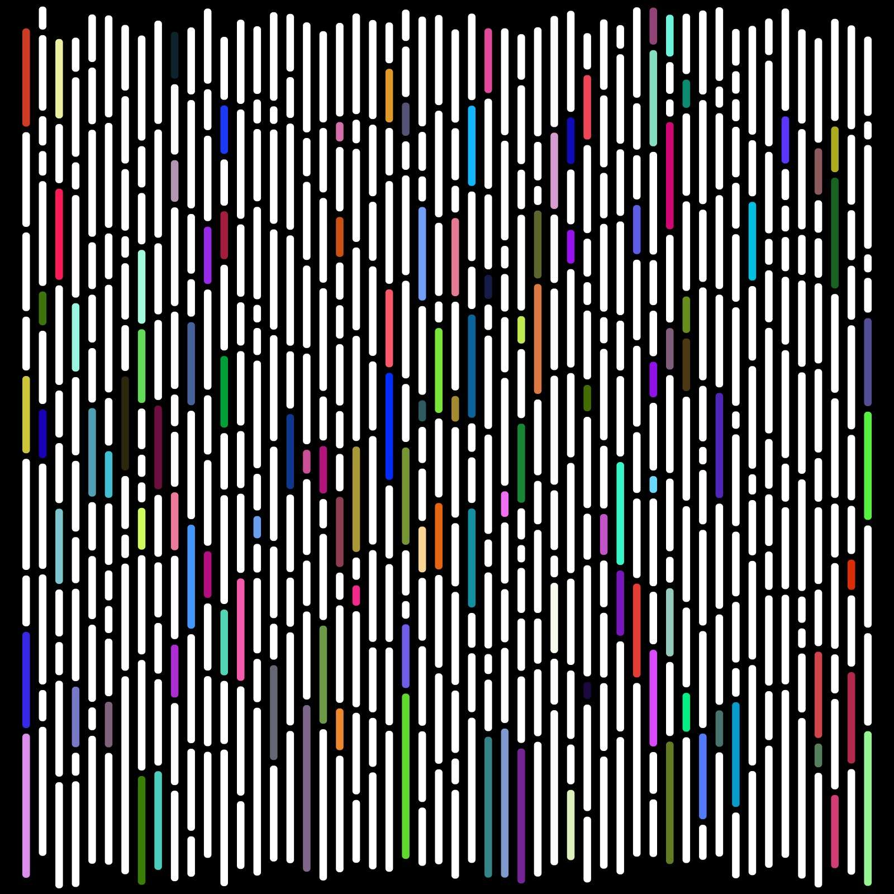

# Cathode

少量的颜色和嘈杂的失真创造了视觉上引人注目的作品，其中秩序是从简单的混乱中指挥的。 仔细阅读字里行间，您会明白，这不仅仅是眼前所见。这一系列 1000 件生成艺术作品是对过去一年的视听技术的致敬。所有版本都保护在专用的 IPFS 网关上。 这意味着您的购买对集中实体是安全的。 因此，当您购买阴极时，您就拥有了一个阴极。

一些色彩和嘈杂的失真创造了视觉上引人注目的作品，其中秩序是从简单的混乱中指挥的。在字里行间阅读，你会明白，不仅仅是满足眼球。

这个由1000个生成艺术作品组成的系列是对昔日视听技术的致敬。

