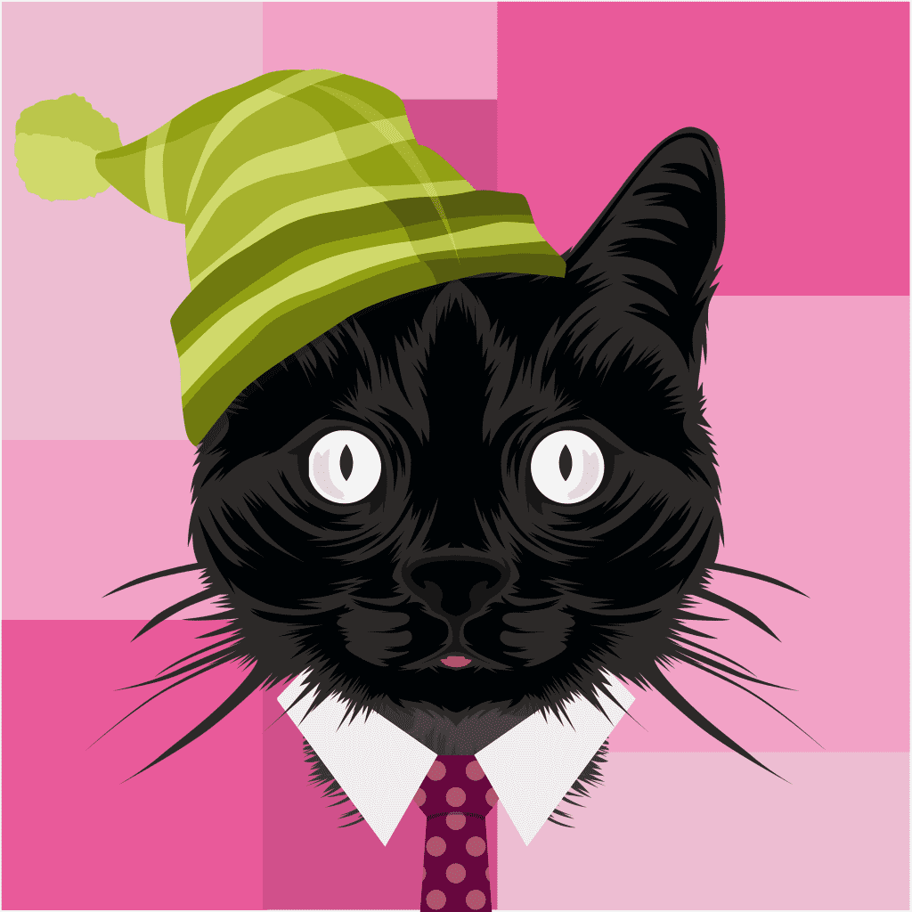

# Cats of the MetaSouk

MetaSouck 的猫是 1,000 只独特的猫的集合，它们在区块链上以 NFT 的形式存在。猫以 ERC721 代币的形式存储在以太坊区块链上。 拥有者可以下载 .png 格式的猫，他们还可以请求它们的高分辨率图像，很快就会为每个人提供 3D 模型。猫不仅是涂料设计的角色收藏品，它们还可以作为您进入独家世界的门票 内容。 从开发新系列以填充我们的宇宙，到 MetaSouck 头像，我们正在开发一系列很棒的功能。

