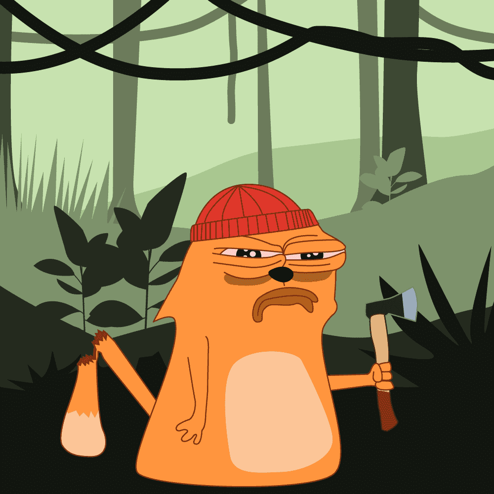

# Catshit Crazy

猫叫喵。 猫毛茸茸的。 猫是谎言。 佩佩加索画猫？ 猫屎疯了？ 但是，是的，这是真的。 猫很有趣，值得被记忆。 这些猫有不同的感觉、毛皮颜色和许多其他属性，构成了无数有趣的变化。 让你的猫今天发疯。

是的，弗伦看起来很罕见。 如果你的猫是乍得或者更像是普通类型的动物，请在下面检查。 这是一个完整的特征和属性列表以及它们的稀有性。

我为什么要买猫佩佩卡索？
公元前看起来很少见

官方铸币什么时候开始pepecasso？
世界标准时间 2021 年 8 月 27 日星期五 16:00

铸币是如何工作的pepecasso？
容易的。 你点击连接钱包，然后你可以铸币。 一枚铸币厂的成本为 0.0420 ETH。 你最多可以铸币 20 个。 每个钱包最多可以铸造 69 个。

