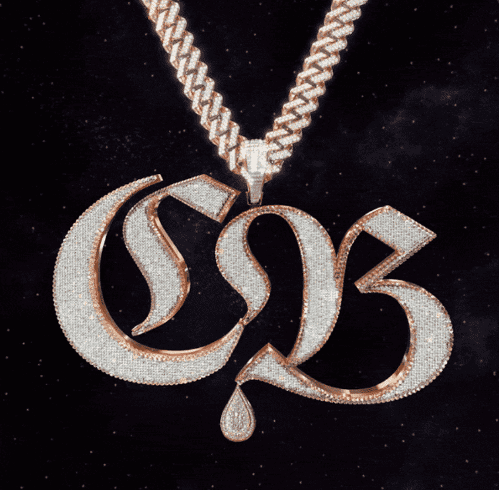

# CB Official Collection

Cold Behavior 代表 5,555 个独特 NFT 的集合，按稀有程度分类，由 200 多个元素生成。 ‍Cold Behavior 的代币以 ERC-721 A 代币的形式存储在以太坊区块链上，并托管在一个星际文件系统 (IPFS) 上。‍ 该项目的诞生是为了在音乐产业、时尚产业和网络 3.0 之间建立联系。

CB 官方合集 NFT - 常见问题（FAQ）
▶ 什么是 CB 官方收藏？
CB Official Collection 是一个 NFT (Non-fungible token) 集合。 存储在区块链上的数字艺术品集合。
▶ CB 官方收藏代币有多少？
总共有 1,399 个 CB 官方收藏 NFT。 目前，151 位车主的钱包中至少有一个 CB Official Collection NTF。
▶ 最近卖出了多少CB Official Collection？
过去 30 天内共售出 0 个 CB Official Collection NFT。

