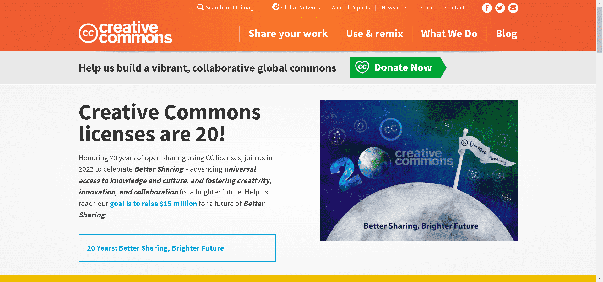

# Creative Commoners

每个人都有 2222 个 Creative Commoners。

20 亿的作品和计数。探索以下这些精选的知识共享许可资源——从文学作品到视频、照片、音频、开放教育、科学研究等等！或者您可以分享您的工作，并帮助点亮全球公地！

分享很重要。多亏了数字革命，我们分享了前所未有的东西，从科学研究到家庭照片，从日常生活到大学课程——而且都是即时的。即使在十年前，今天分享的多样性和数量也是难以想象的。现在社交媒体和发布平台、智能手机、廉价数据和扩展的互联网……

