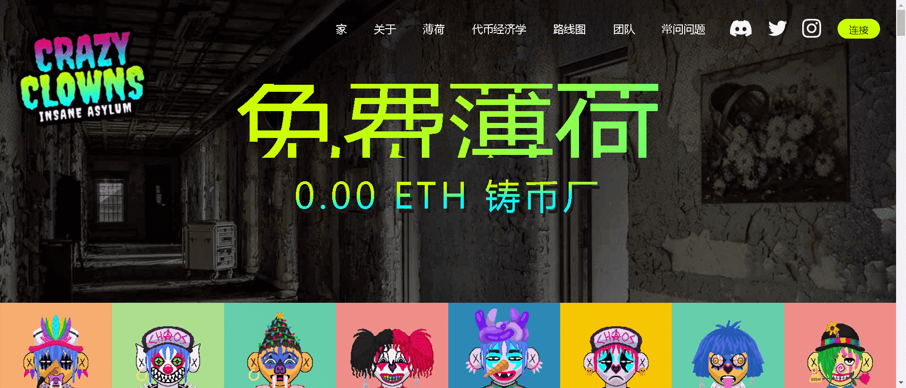

# Crazy Clown Insane Asylum (Official)

Crazy Clown Insane Asylum 是以太坊区块链上的一个生态系统，由常驻疯子 - Crazy Clowns - 9696 个 NFT 像素艺术小丑组成。$BALLOON 代币是为 CCIA 生态系统提供动力的实用工具。铸币厂所有者可以立即质押您的疯狂小丑，每天将收到 96 个 $BALLOON 代币。收集到 966 个 $BALLOON 代币后，您可以将您的疯狂小丑进化为更邪恶、更强大的 Evil Ringmaster NFT。有史以来最大供应量仅为 3500 个 Evil Ringmasters，您每天可以质押以获得 240 个 $BALLOON 代币。当您铸造邪恶的魔戒大师时，您最初的疯狂小丑会被烧毁。

$BALLON 在 CCIA 生态系统中没有其他功能，并且不能从 CCIA 开发者处购买。

