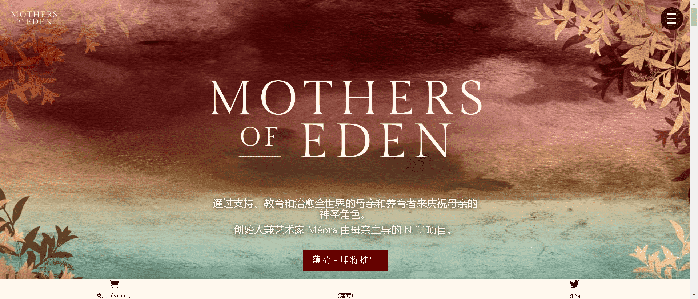

# Celestial Mothers

通过支持、教育和治愈全世界的母亲和养育者来庆祝母亲的神圣角色。
创始人兼艺术家 Méora 由母亲主导的 NFT 项目。

Mothers of Eden 是一个 NFT 合集，包含 7,777 位母亲和她们的孩子，基于地球创造和伊甸园 7 天的原型故事；逆境前世界中的天堂。
每个婴儿都讲述了母亲的故事，她被药草和美丽的植物所包围，这些植物有益于健康，象征着治愈。
该艺术使用符号来描绘婴儿，以代表每个婴儿与母亲的独特关系。这种模糊性为收藏家自己对生活在对立世界中的快乐和考验的经历提供了解释的空间。它也可能代表一个孩子独特的个性、属性或综合症，或者作为一个象征着观众自己内心的孩子被一个充满爱的神圣女性形象所拥有。

