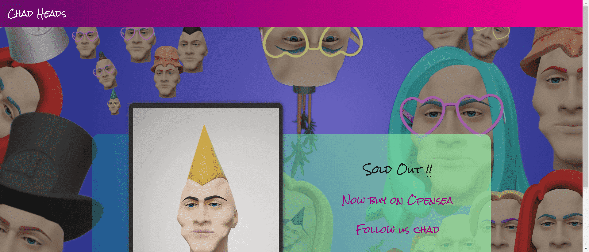

# Chad Heads

不为任何人，为所有人。也许什么都没有，很少有人能理解。

Chad 不仅仅是一名自由艺术家，他还是耐克 3D 设计的负责人，不久前他从 1998 年至 2011 年的职业滑板手的激动人心的职业生涯中退休。如今，当他不在耐克工作时，他独特的艺术作品受到世界各地人们的喜爱。Chad Knight 充满活力的数字艺术在冥想和狂热之间穿梭。艺术家的个人作品似乎存在于外星世界，他的作品是在 Cinema 4D 中制作的。这些是进化中期出现的巨大精巧生物居住的地方。作为持续多产努力的一部分，这位艺术家每天都会在他的 Instagram 帐户上发布一个新作品。

