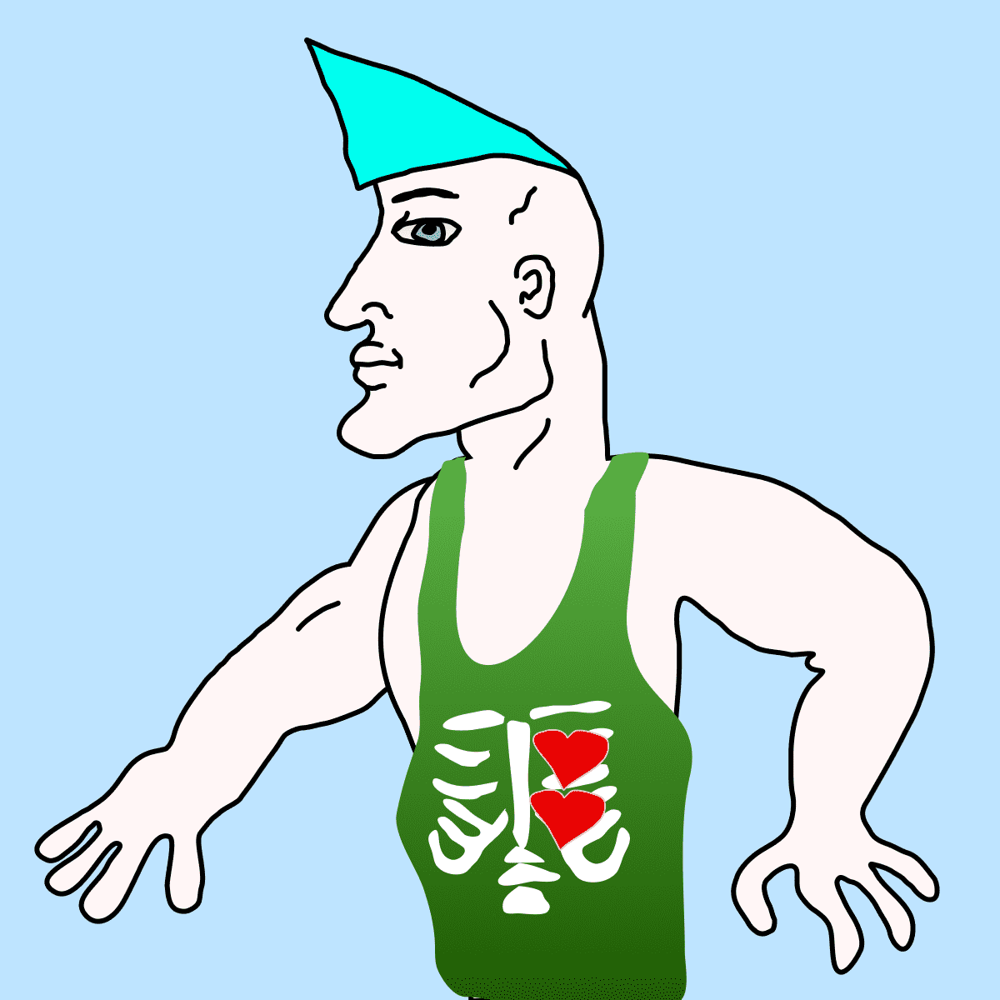

# Chads NFT

它是 Degen 艺术家的 10,000 个独特手绘 Chad NFT 的集合。Chad 代表 DeFi 和 NFT 空间的早期采用者。 乍得痴迷于交易垃圾币和模仿未经审计的协议。 当你的处女朋友购买 Facebook 或 Apple 股票并等待 10 年赚取 2 倍利润时，你通过购买 50 倍杠杆的 DOGE 币、种植蔬菜代币和铸造一些花哨的 NFT 来赚取 100 倍的利润。

在某些时候，乍得 NFT 将成为 如此罕见。 它将成为历史。 从处女中脱颖而出，成为拥有自己 NFT 的乍得。加入乍得的派对，成为传奇 🦍

