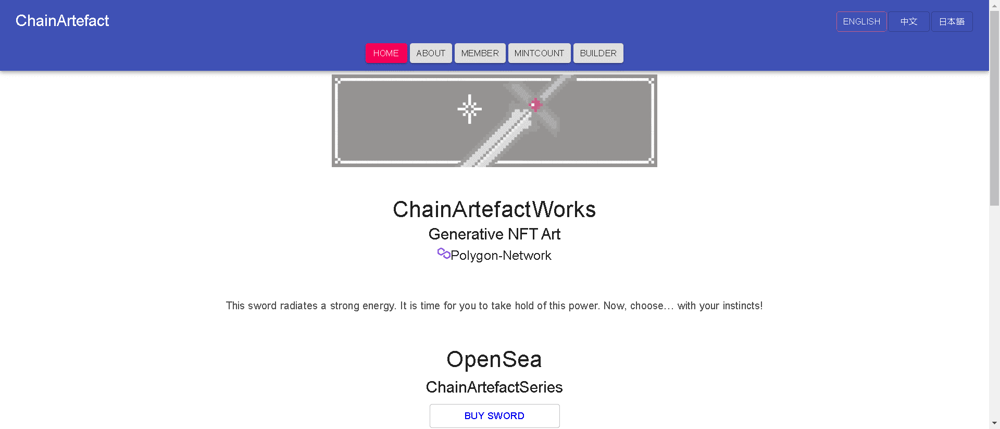

# ChainArtefact(Shield)

全链人工制品系列。盾版。

这个盾牌散发出强大的能量。现在是你掌握这种力量的时候了。现在，选择……用你的直觉！

▶ 什么是链神器（盾）？
ChainArtefact(Shield) 是一个 NFT (Non-fungible token) 集合。存储在区块链上的数字艺术品集合。

▶ ChainArtefact(Shield) 代币有多少？
总共有 7,482 个 ChainArtefact(Shield) NFT。目前 1,210 位所有者的钱包中至少有一个 ChainArtefact(Shield) NTF。

