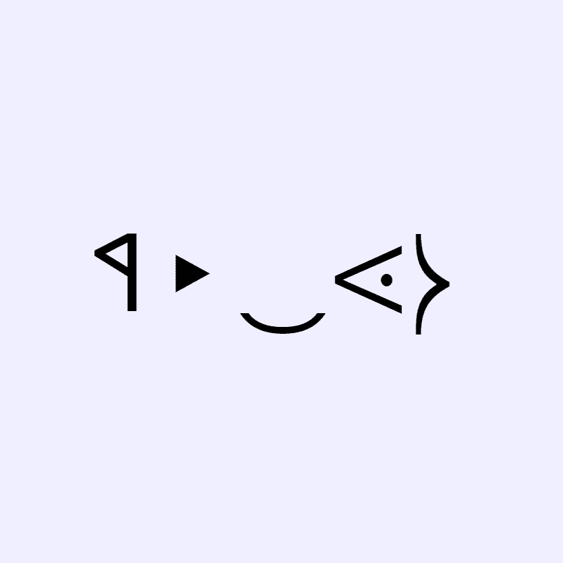

# ChainFaces Arena

ChainFaces Arena 是备受期待的原始链上生成 ASCII 文本面孔的继任者。 智能合约生成器生成随机面孔，一旦计时器用完或铸造了最大数量的面孔，就会显示这些面孔。 竞技场是核心体验的一部分，ChainFaces 可以在这里竞争成为冠军。 死在竞技场意味着 NFT 永远消失了。 在竞技场中存活的 ChainFaces 通过实时更新他们的战斗分数以及每存活 10 轮获得生成性伤疤的能力来获得奖励。

ChainFaces Arena是备受期待的原始链上生成ASCII文本面孔的精神继承者。智能合约生成器产生随机人脸，一旦计时器用完或铸造出最大数量的人脸，就会显示出来。

