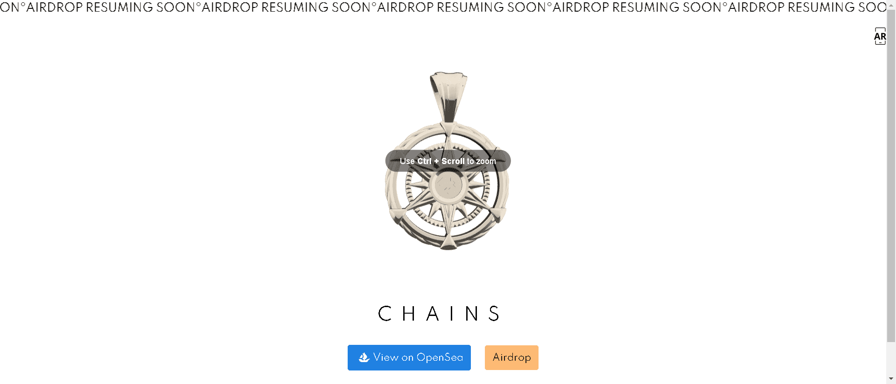

# Chainsdrop - Volume 1

CryptoJeweler 的团队展示了专门为 Chains NFT 持有者生产的第一个 phygital 资产分配。

▶ 什么是链条掉落 - 第 1 卷？
Chains Drop - 第 1 卷是一个 NFT（非同质代币）集合。存储在区块链上的数字艺术品集合。

▶ 有多少 Chains Drop - Volume 1 代币存在？
总共有 7 个 Chains Drop - 第 1 卷 NFT。目前，1,171 位所有者的钱包中至少有一个 Chains Drop - 第 1 卷 NTF。

▶ 什么是最昂贵的 Chains Drop - Volume 1 销售？
售出的最昂贵的 Chains Drop-Volume 1 NFT 是 Chain Gang Pendant。它于 2022 年 7 月 3 日（大约 2 个月前）以 120 美元的价格售出。

