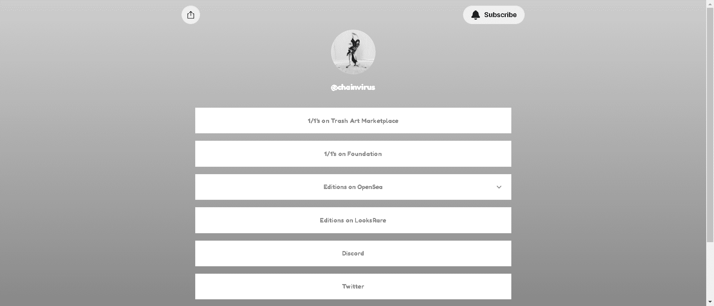

# CHAIN VIRUS EDITIONS

来自 Chain Virus 的持续纪录片收藏，以低版本的形式交付给代币持有者。

“PAINTER TOKEN”的持有者将获得空投的终身通行证，并在第一线发现所有东西链病毒。

▶ 什么是 CHAIN VIRUS 版本？
CHAIN VIRUS Editions 是一个 NFT（不可替代令牌）集合。存储在区块链上的数字艺术品集合。

▶ 存在多少 CHAIN VIRUS Editions 代币？
总共有 11 个 CHAIN VIRUS 版本 NFT。目前 25 位所有者的钱包中至少有一个 CHAIN VIRUS Editions NTF。

▶ 最昂贵的 CHAIN VIRUS Editions 销售是什么？
出售的最昂贵的 CHAIN VIRUS 版本 NFT 是 BAD INFLUENCE。它于 2022 年 6 月 24 日（2 个月前）以 142.7 美元的价格售出。

