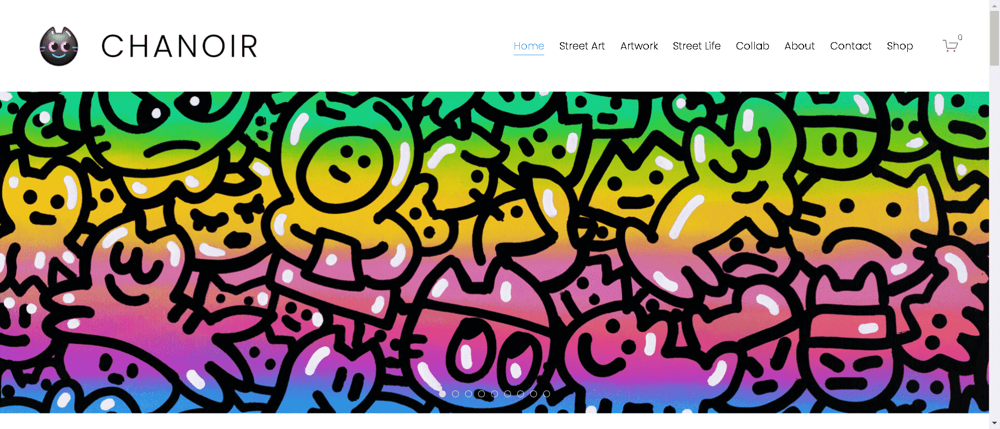

# Chanoir - The Collectibles x XorART

Metamorphosis and Beyond: a Chanoir Anthology是由世界著名街头艺术家 Chanoir 在以太坊区块链上创建的独特手工 NFT 的有限集合。

每个角色都是艺术家创作的独特故事情节的一部分，也是他自己在数字空间中经历的一种表达：一生的作品汇编在一个永久刻在区块链中的收藏中！

注重细节：从永远消失的历史背景壁画，到 Chanoir 重新审视的标志性服装和配饰，这个手工制作的系列达到了可以说是前所未有的细节水平。

XorART 是一个致力于法国触觉艺术运动的策划和孵化 NFT 平台和机构。

