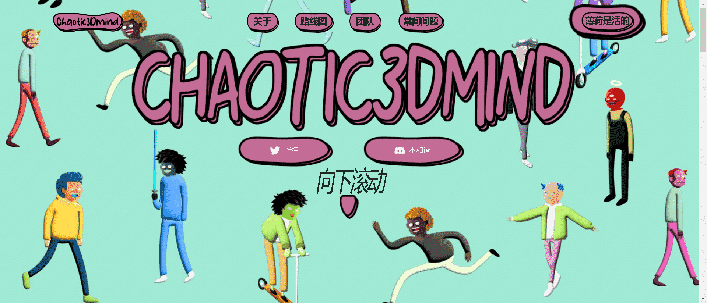

# Chaotic3Dmind

Mindblast 项目的一个有趣变体。

这个项目的灵感来自于 Mindblast Universe 项目。它不隶属于任何项目。通过Chaotic3DMind等具有创新视角的衍生项目，可以进一步丰富在收藏中付诸实践的已知真理和想法。作为 The MindBlown Universe NFT 的衍生产品，Chaotic3DMind 项目是通过项目团队的远见、创新的生产和积极的管理模式，实现双赢战略的体现。

Chaotic3DMind 由具有远见和积极原则的专业团队进行战略管理。它不与主要项目竞争。它以一种有利于主项目的形式利用其竞争力和能量对抗其他衍生项目。Chaotic3DMind 提供社会领域的社会贡献以及技术发展计划。作为一个衍生品，Chaotic3DMind 在主项目之后首先聚集力量，以便他们能够在离当前位置更远的位置上。Chaotic3DMind 将其人力和技术资源用于通过有效利用其人力和技术资源来产生最大效率的潜力。

