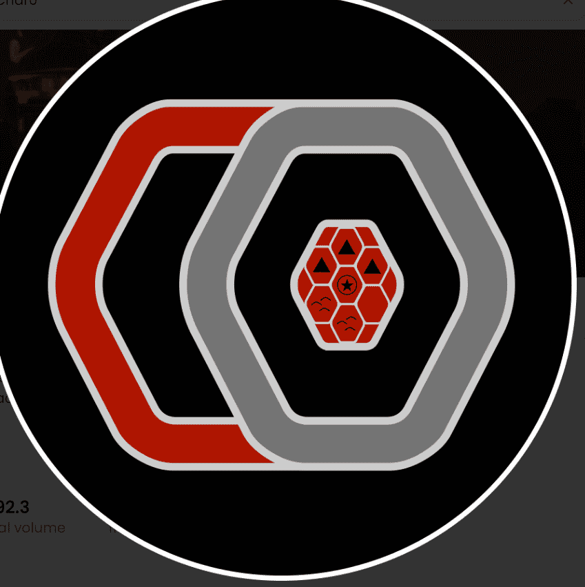

# Char0

这个数字集合的意义远不止它们的数值。 这些数字意味着冒险。 每个 Char0 NFT 都为字符提供了第一个构建块。

Char0 NFT - 常见问题（FAQ）
▶ 什么是 Char0？
Char0 是一个 NFT（不可替代令牌）集合。存储在区块链上的数字艺术品的集合。
▶ 有多少 Char0 代币存在？
总共有10，000个Char0 NFT.目前有2，040个所有者在他们的钱包中至少有一个Char0 NTF。
▶ 最近卖了多少Char0？
在过去 30 天内售出了 0 Char0 NFT。
▶ 什么是流行的Char0替代品？
许多拥有Char0 NFT的用户还拥有DerpDerp DerpDerp，Wicked Craniums Comic，Toy Frens和OmniGalaxies。

