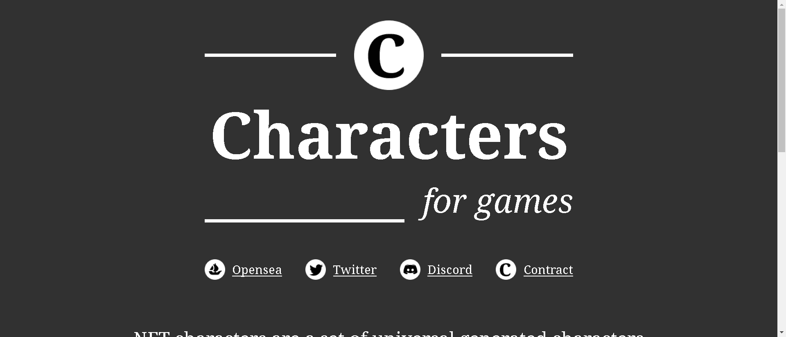

# Characters (for games)

NFT 字符是在区块链中创建和存储的一组通用生成字符。它们可以在未来的各种角色扮演游戏中使用。

▶ 什么是Characters (for games)？
Characters (for games) 是一个 NFT（不可替代代币）集合。存储在区块链上的数字艺术品集合。

▶ 有多少个 Characters (for games) 代币？
总共有 1300个Characters (for games) NFT。目前 275位所有者的钱包中至少有一个 Characters (for games) NTF。

