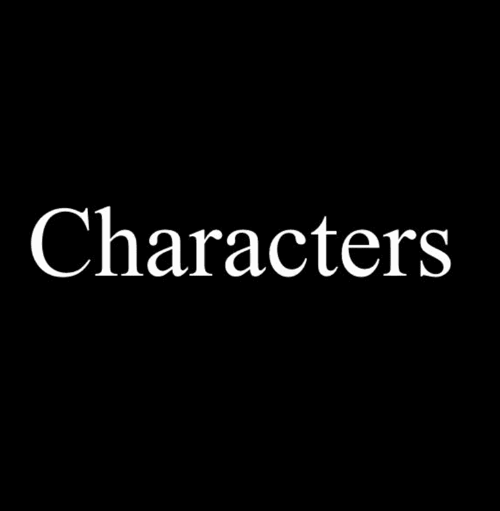

# Characters (for Adventurers)

这是 Characters 的 OpenSea 目录是随机生成并存储在链上的。 它们是作为 Loot 生态系统的一部分而创建的。 Characters 的目标是通过额外的可能性和交互来扩展 Loot 生态系统。角色团队与其他衍生项目一起致力于将 Loot 和 Characters 结合起来的元素、游戏、集成和参与可能性。故意省略图像和其他功能 供其他人解释。随意以您想要的任何方式使用字符。

什么是角色（对于冒险家）？
角色（用于冒险家）是NFT（不可替代令牌）集合。存储在区块链上的数字艺术品的集合。
▶ 有多少个角色（对于冒险家）令牌存在？
总共有7，249个角色（冒险家）NFT.目前有2，495个所有者在他们的钱包中至少有一个角色（对于冒险家）NTF。
▶ 最近卖了多少个角色（冒险家）？
在过去的30天内，有0个角色（冒险家）NFT售出。
▶ 什么是流行的角色（冒险家）替代品？
许多拥有角色（冒险家）NFT的用户也拥有Moon Kongz Test，Phouns NFT，sismo.eth DAO和Template。

