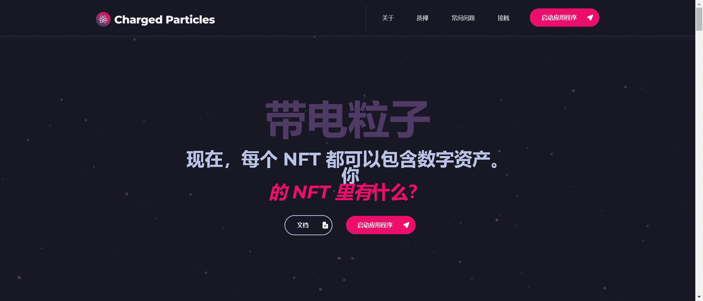

# Charged Particles - Proton

质子是在 Charged Particles 平台上铸造的定制 NFT，能够保持电荷！

我们是一个 NFT 协议，位于 DeFi 和 NFT 的最前沿，将艺术和金融融为一体。我们的新技术使用户能够将数字资产存入他们的 NFT 中。

我们的目标是成为 NFT 发展的核心基础设施技术。为此，我们已经开始将我们的协议本地集成到 NFT 平台中。事实上，总有一天，所有 NFT 都可以选择“收费”：未来，我们的协议将无处不在。

每次在任何区块链上、任何市场上创建 NFT 时，它都将能够使用我们的技术。而且，当人们想到 NFT 时，他们会想到 Charged Particles。

