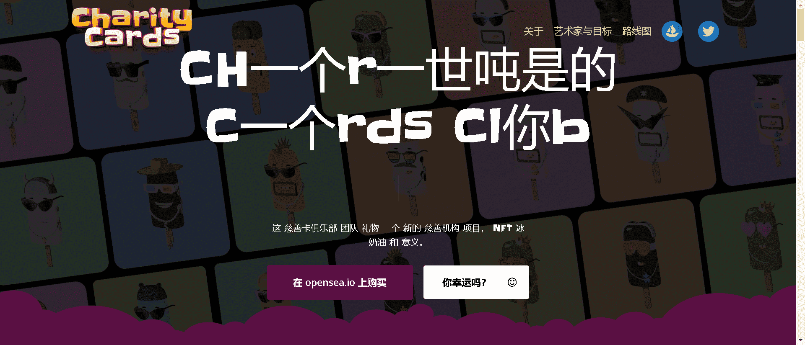

# Charity Cards Club

冰淇淋的概念是直接联想到寒冷的元素，在某些地方残酷而冷漠，就像现实世界中的残疾儿童一样。但与此同时，冰淇淋所提供的美味和情感的光辉，就像特殊的孩子通过在艺术中实现自己给我们的世界一样。

代币的创造者是一位名叫雅罗斯拉夫 K 的才华横溢的 3D 小艺术家。这个男孩生来就失聪，但由于植入了人工耳蜗，他能够听到声音。他支持有特殊需要的儿童的愿望是我们项目的起点。

我们的主要目标是让教授数字艺术成为可能，帮助、揭示和发展特殊儿童在这一领域的能力。

