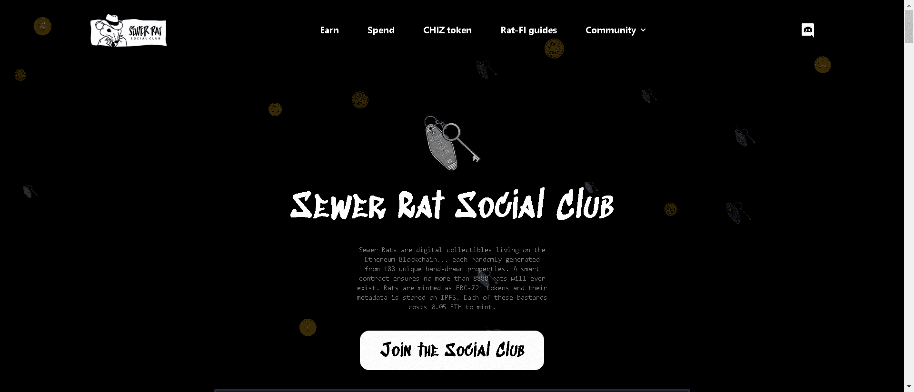

# Cheddaz

SRSC 大鼠的兴奋剂乳制品伴侣。每一个 Chedda 都是一个独特的善良部分 - 以编程方式从 150 多个特征生成。

存储在以太坊区块链上的冷藏中。

下水道老鼠是生活在以太坊区块链上的数字收藏品……每一个都是从 188 个独特的手绘属性中随机生成的。智能合约可确保不超过 8888 只老鼠存在。老鼠被铸造为 ERC-721 令牌，它们的元数据存储在 IPFS 上。这些混蛋中的每一个都需要 0.05 ETH 来铸造。

