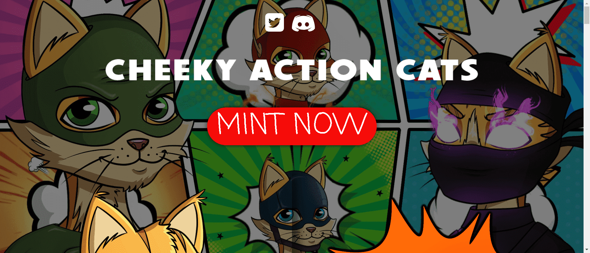

# CHEEKY ACTION CATS OfficiaI

最大供应量为**8888 CHEEKY ACTION CATS**。

每个 CHEEKY ACTION CAT 将花费**0.1 ETH**。

$MICE 是一种通货紧缩的实用代币，为 CHEEKY ACTION CATS 生态系统提供动力。NFT 所有者将能够通过质押获得它。然后，$MICE 可用于铸造 3D 版或为猫购买武器和配件。它还将用于社区对项目进一步发展的投票权

