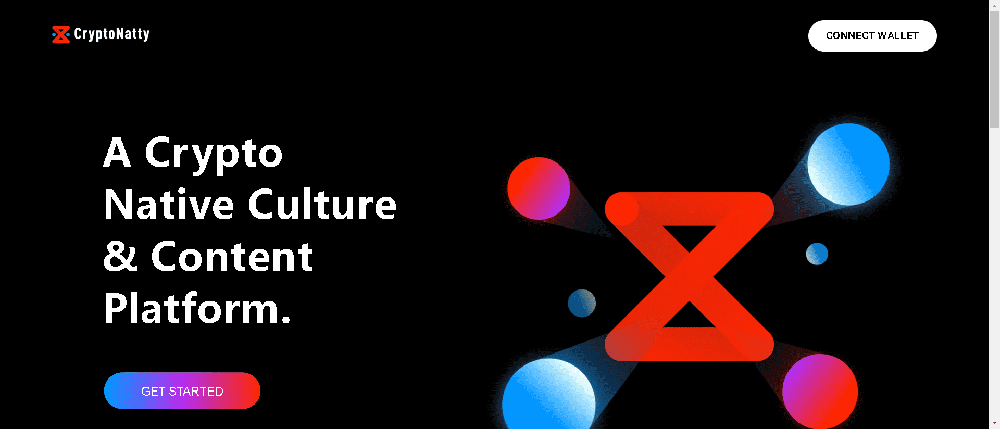

# Cheers UP Emoji

Cheers UP Official 的 NFT 表情符号。每个 CUP 都有自己的游戏，收集和探索更多。

▶ 什么是 Cheers UP 官方？
Cheers UP Official 是一个 NFT（非同质代币）集合。存储在区块链上的数字艺术品集合。

▶ Cheers UP 官方代币有多少？
总共有 3,754 个 Cheers UP 官方 NFT。目前，1,551 位车主的钱包中至少有一个 Cheers UP Official NTF。

▶ 最昂贵的 Cheers UP 官方促销是什么？
最昂贵的 Cheers UP Official NFT 是 Cheers UP #3647。它于 2022 年 6 月 6 日（3 个月前）以 5.4 万美元的价格售出。

