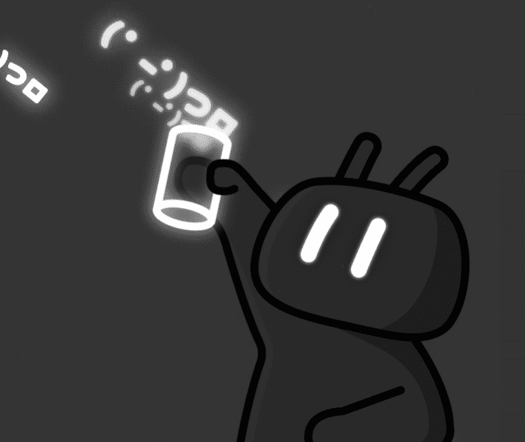

# Cheers UP Period

Cheers UP 是 bilibili 委托的一系列 NFT。Cheers UP Periods 用于兑换 Cheers UP 角色。 1 次欢呼期 = 1 次随机欢呼。

heers UP是由bilibili委托的一系列NFT。这是一个新的海外系列，在CryptoNatty推出。Cheers UP是以编程方式生成的角色，每个角色都有一个惊人而独特的设计。

欢呼作为ERC-721令牌存储在以太坊区块链上，并托管在IPFS上。

“干杯”是哔哩哔哩最具代表性的社区文化之一。“小电视”是哔哩哔哩的官方IP。CryptoNatty是一个建设平台，将与哔哩哔哩进一步合作和探索。

