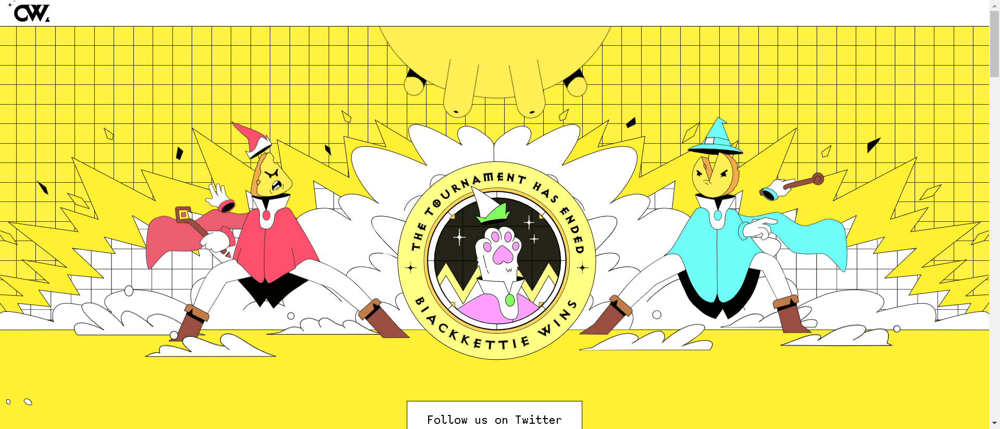

# CheezeWizard

每个奶酪精灵都是特别的。他们是不朽的，神奇的，并且能够改变世界的壮举。可悲的是，他们大部分时间都在网上陷入小分歧。

奶酪巫师锦标赛由一系列决斗组成，最终最强大的巫师被加冕为**大奶酪**。

▶ 什么是CheezeWizard？
CheezWizard 是一个 NFT（非同质代币）集合。存储在区块链上的数字艺术品集合。

▶ 有多少 CheeezeWizard 代币？
总共有 7,916 个 CheezWizard NFT。目前，1,407 位所有者的钱包中至少有一个 CheezWizard NTF。

▶ 最昂贵的 CheeezeWizard 销售是什么？
出售的最昂贵的 CheezWizard NFT 是 Wizard #2334 (P210)。它于 2022-08-26（4 天前）以 70.3 美元的价格售出。

