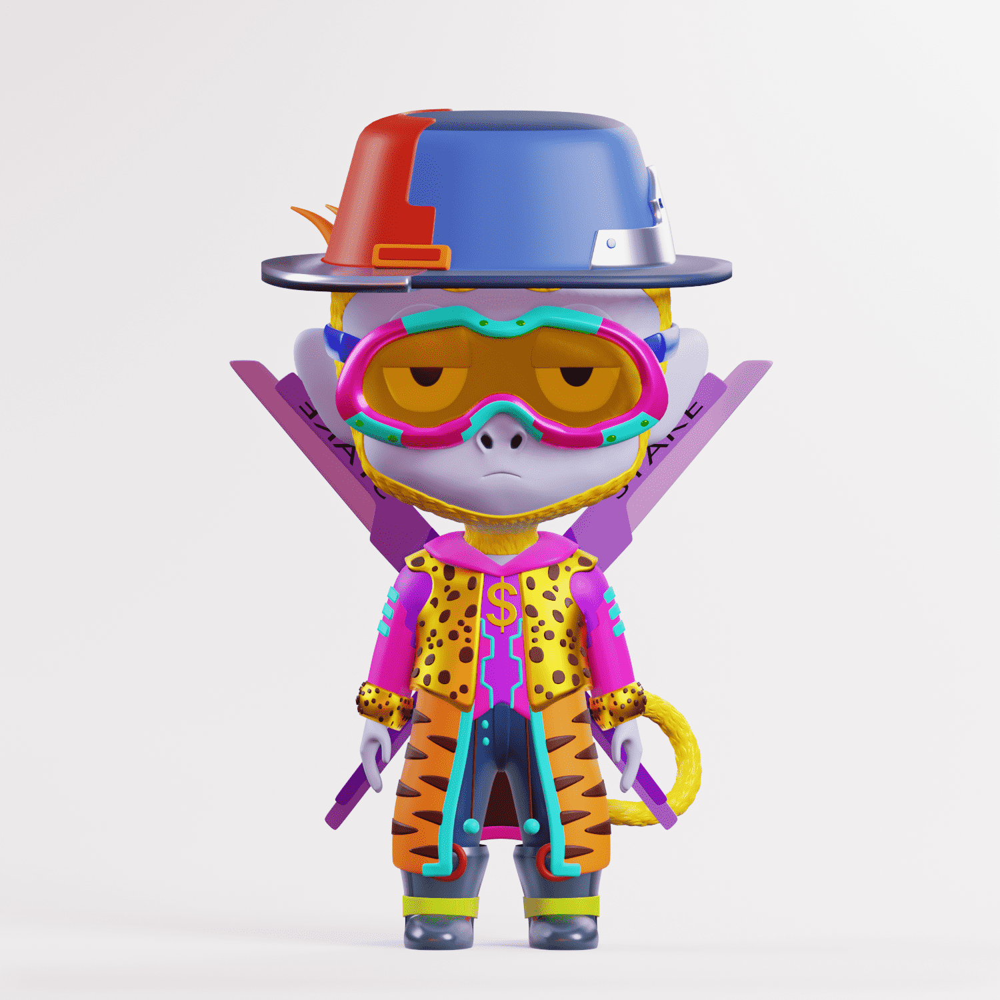

# Chibi Apes

围绕以太坊区块链随机生成的 3000 个 3D 角色。 每只猿都是由 119 种可能的特征创造出来的，其中至少有 4 种特征不同，确保每只猿都是高度独特的！

Chibi Labs是售罄的Chibi Genesis，Apes和Galaxy 3D头像系列的NFT工作室。凭借这些Metaverse和Web3配备的独家NFT头像集合，高度参与的社区以及对教育，集成和商业化的重视，Chibi Labs的使命是使Web3对所有人都具有可访问性和包容性。

Chibi Genesis是OG系列，为Chibi Labs奠定了基础。赤壁猿引发了3D革命，为新成立的赤壁民族带来了叛逆，高度个人化的表达。Chibi Galaxy是另一个世俗的，面向未来的系列，它带来了技术前沿的齿轮和能力，为Chibiverse的推出做准备。

