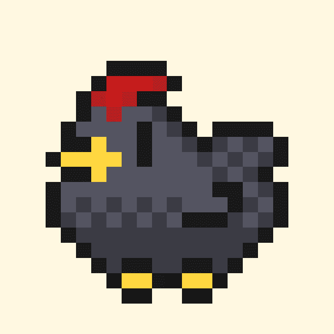

# Chicken DAO Game

ChickenDAO 是一款独特的区块链社区游戏。 每天买一只鸡并收集$EGGS。

鸡道游戏NFT - 常见问题（FAQ）
▶ 什么是鸡肉DAO游戏？
Chicken DAO Game是一个NFT（不可替代令牌）集合。存储在区块链上的数字艺术品的集合。
▶ 有多少个鸡道游戏代币存在？
总共有1，728个Chicken DAO Game NFT.目前有301个所有者在他们的钱包里至少有一个Chicken DAO Game NTF。
▶ 最昂贵的鸡肉DAO游戏销售是什么？
NFT出售的最昂贵的Chicken DAO游戏是Chicken DAO。它在2022-06-10（3个月前）以$ 7.1的价格出售。
▶ 最近卖了多少只鸡道游戏？
在过去30天内售出了1个鸡DAO游戏NFT。

