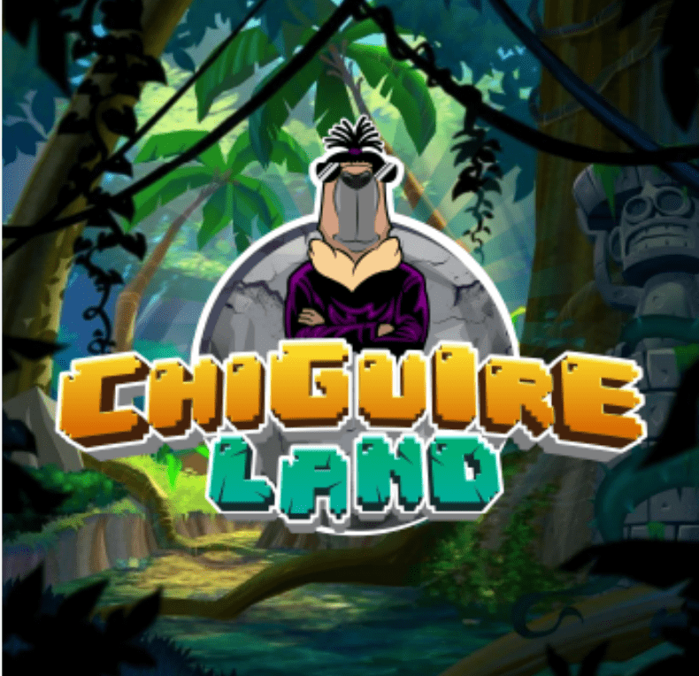

# CHIGUIRELAND

CHIGUIRE LAND 是一个 NFT 项目，基于在项目中作为股份的能力：“Amazonas 和 Chiguireland”。换句话说，它是一种可转让的共同所有权制度

▶ 什么是CHIGUIRELAND？
CHIGUIRELAND 是一个 NFT（非同质代币）集合。存储在区块链上的数字艺术品集合。
▶ CHIGUIRELAND 代币有多少？
总共有 3,988 个 CHIGUIRELAND NFT。目前，821 位车主的钱包中至少有一个 CHIGUIRELAND NTF。
▶ CHIGUIRELAND 最昂贵的交易是什么？
最昂贵的 CHIGUIRELAND NFT 是 CHIGUI#326。它于 2022-06-08（3 个月前）以 27.2 美元的价格售出。
▶ 最近卖了多少CHIGUIRELAND？
过去 30 天内售出了 24 个 CHIGUIRELAND NFT。
▶ CHIGUIRELAND 的费用是多少？
过去 30 天，CHIGUIRELAND NFT 最便宜的销售额低于 5 美元，最高销售额超过 20 美元。过去 30 天内，CHIGUIRELAND NFT 的中位价格为 9 美元。
▶ 什么是流行的 CHIGUIRELAND 替代品？
许多拥有 CHIGUIRELAND NFT 的用户还拥有 The Kangaroos NFT Club、 Cryptato Planet、 Purple Ape Club Old和 Kawaii Bears。

