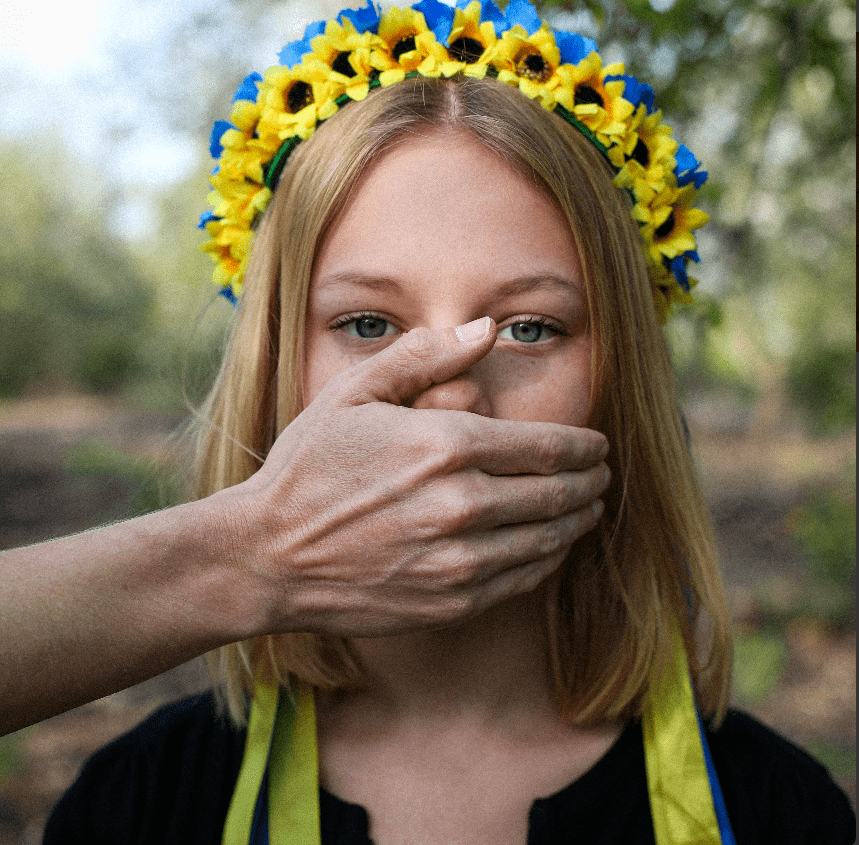

# Children War Crimes

战争一开始，我们就决定把战场上妇女儿童的故事搬上舞台。
我们开始研究并与数百名女性/青少年/女孩谈论她们的个人故事。
我们将这些故事变成了 NFT 创造论者。每一件衣服的背后，都有一个真实女人经历过战争的故事。
那么，它是如何工作的？
您正在购买 NFT。
我们将您购买的收益捐赠给帮助妇女和儿童康复的乌克兰慈善机构（“GO Girls”）。
此外，在您每次购买时，我们都会为一无所有的女性捐赠一件衣服

