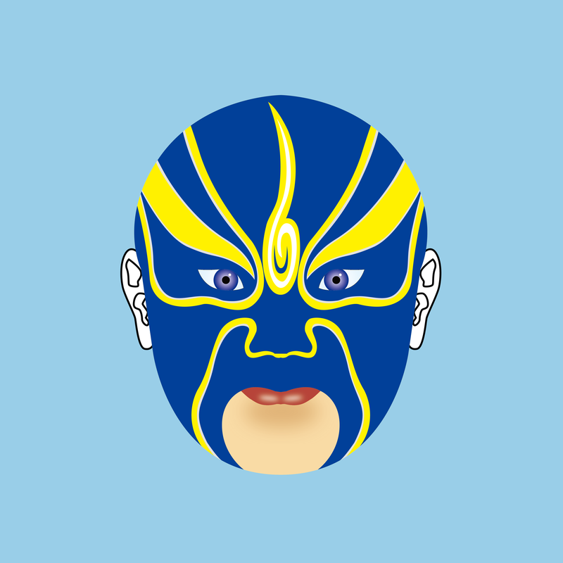
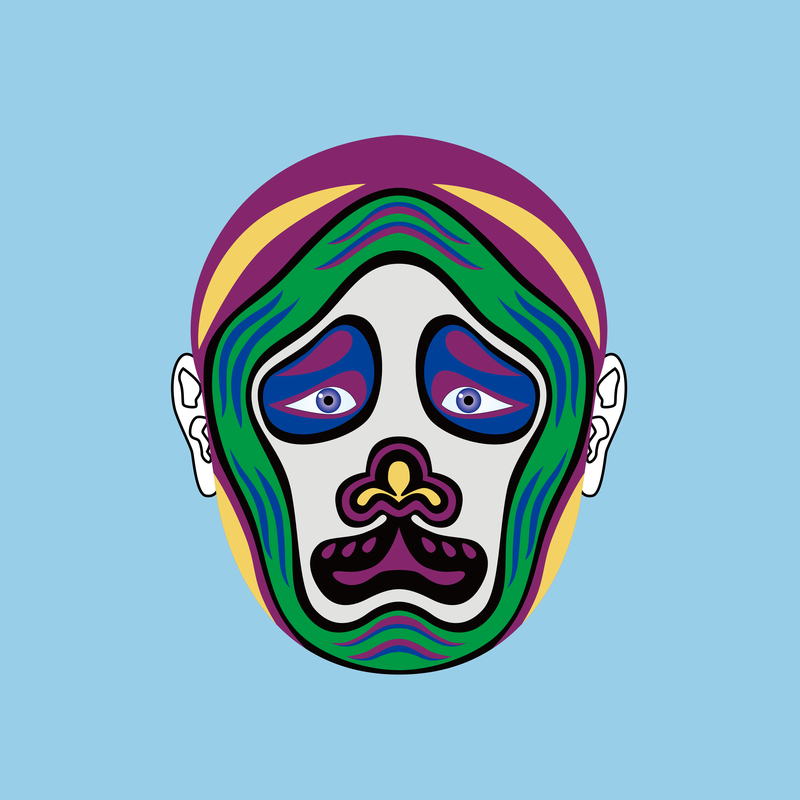

# Chinese Opera Mask Plus

项目网站、社交联系方式、项目介绍内容详见：https://opensea.io/collection/chinese-opera-mask-plus

Chinese Opera Masks+（简称：COMP）是基于以太坊区块链的NFT集合，由中国传统戏曲艺术创作而成。面部设计、眼睛和颜色的随机变化创造了各种各样的面具 NFT。

 ▶ 什么是戏曲面具？

Chinese Opera Mask Plus 是一个 NFT (Non-fungible token) 集合。存储在区块链上的数字艺术品集合。

##### ▶ 戏曲面具Plus代币有多少？

总共有 3,525 个中国戏曲面具 Plus NFT。目前，1,008 位车主的钱包中至少有一个中国戏曲面具 Plus NTF。

##### ▶ 最近卖了多少个戏曲面具？

过去 30 天内共售出 0 件戏曲面具 Plus NFT。

