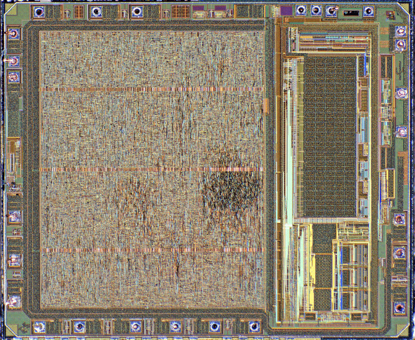

# ChipArt

这个芯片艺术系列揭示了微芯片隐形世界令人难以置信的美丽和多样性。 通过拥有来自前所未有的 2,750 个 NFT 集合的手工精选高分辨率照片，参与保护 IT 历史。

在过去的 25 年中，Antoine Bercovici 博士（又名 Siliconinsider）一直致力于深入挖掘计算机芯片以了解其中隐藏的内容。 结果确实令人兴奋。

Siliconinsider 是一名专业研究人员，专门研究显微镜摄影。 通过拆解芯片通常只有几毫米大小，他在显微镜下揭示了它们的真正美丽。 有些芯片非常精细和微小，以至于每个芯片需要拍摄数百张照片，然后以数字方式将它们拼接在一起以形成一张大图像。 使用此过程准备一张详细的图像通常需要数天时间，但结果令人惊叹。

