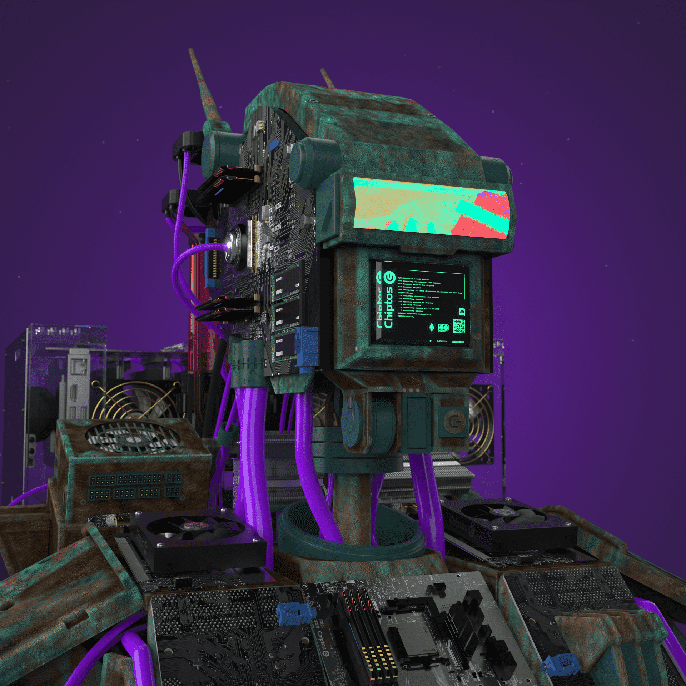

# Chiptos X

来自为您带来 Chiptopunks 的团队，Chiptos X 是由计算机部件制成的下一代高质量 3D 渲染机器人集合。

Chiptos X的总销量为858.48美元。一个Chiptos X NFT的平均价格为42.9美元。有1，051个Chiptos X所有者，拥有3，516个代币的总供应量。

什么是Chiptos X？
Chiptos X是一个NFT（不可替代令牌）集合。存储在区块链上的数字艺术品的集合。
▶ 有多少个Chiptos X代币存在？
总共有3，516个Chiptos X NFT.目前有1，051个所有者在他们的钱包中至少有一个Chiptos X NTF。
▶ 最昂贵的Chiptos X销售是什么？
最昂贵的Chiptos X NFT出售的是。它在2022-06-17（3个月前）以$ 219.6的价格出售。
▶ 最近卖了多少个Chiptos X？
在过去的30天内，有95个Chiptos X NFT售出。
▶ Chiptos X要花多少钱？
在过去的30天里，最便宜的Chiptos X NFT销量低于24美元，最高的销售额超过110美元。Chiptos X NFT的中位数价格在过去30天内为33美元。
▶ 什么是流行的Chiptos X替代品？
许多拥有Chiptos X NFT的用户还拥有臭名昭着的青蛙，Chiptos，小垃圾桶和扩展朋克。

