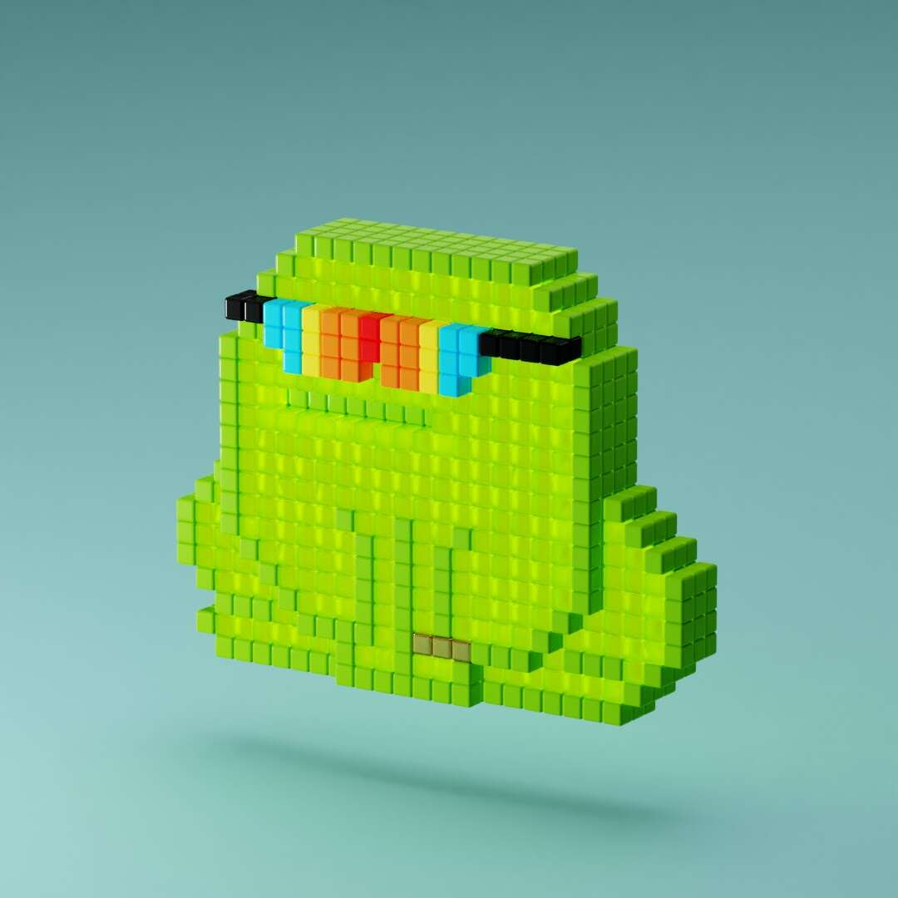

# Choadz

The Chunks 赋予了矮胖的两栖池塘居民。 使用 CC0 域向 CrypToadz 致敬。

什么是乔兹？
Choadz是一个NFT（不可替代令牌）集合。存储在区块链上的数字艺术品的集合。
▶ 有多少个Choadz代币存在？
总共有4，917个Choadz NFT.目前有2，248个所有者在他们的钱包中至少有一个Choadz NTF。
▶ 乔兹最昂贵的销售是什么？
最昂贵的Choadz NFT出售的是Choadz #3768。它在 2022-08-06 （28 天 前） 以 $21.1 的价格出售。
▶ 最近卖了多少乔兹？
在过去的30天内，有13个Choadz NFT售出。
▶ 一个Choadz要多少钱？
在过去的30天里，最便宜的Choadz NFT销售额低于1美元，最高销售额超过24美元。Choadz NFT的中位价格是过去30天的15美元。
▶ 什么是流行的Choadz替代品？
许多拥有Choadz NFT的用户也拥有NotLarvaLads，Spunks，Ape Runners和Metti Landscape。

