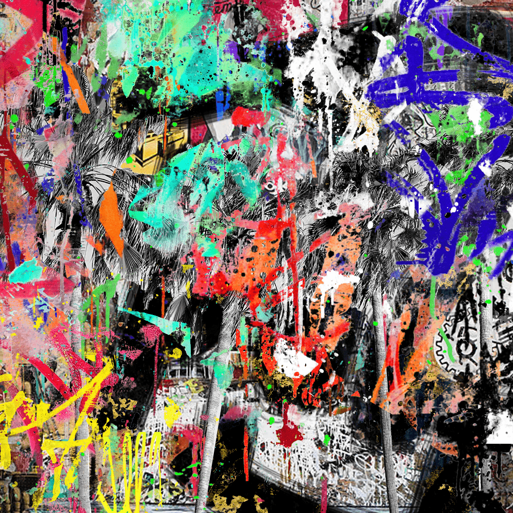

# Chosen Ones by Seek One

Seek One 的 Chosen Ones 收藏了 1,517 件创作艺术作品，这些作品基于当代传奇街头艺术家 Seek One 的手绘作品。 他的创世纪 NFT 系列融合了抽象和涂鸦风格的艺术，将 Seek One 的创作在以太坊区块链上栩栩如生。

《Seek One》是一个由1，517件衍生艺术作品组成的合集，这些作品基于传奇当代街头艺术家Seek One的手绘作品。他的起源NFT系列结合了抽象和涂鸦风格的艺术，使Seek One的作品在以太坊区块链上栩栩如生。

该系列是通过分解专门为Sselected Ones创作的每幅画作Seek One的组成部分以及他的画廊投资组合中的抽象作品来开发的。NFT中的每一笔笔触，喷漆或飞溅物都直接来自Seek One的手。该系列中没有NFT是相同的，每件作品都包含不同的特征，如笔触，颜色，图案，动画等。然而，精美的当代涂鸦艺术的整体主题贯穿整个系列-因此您可以期望Selected Ones具有相似的风格并具有独特的辨识度。

