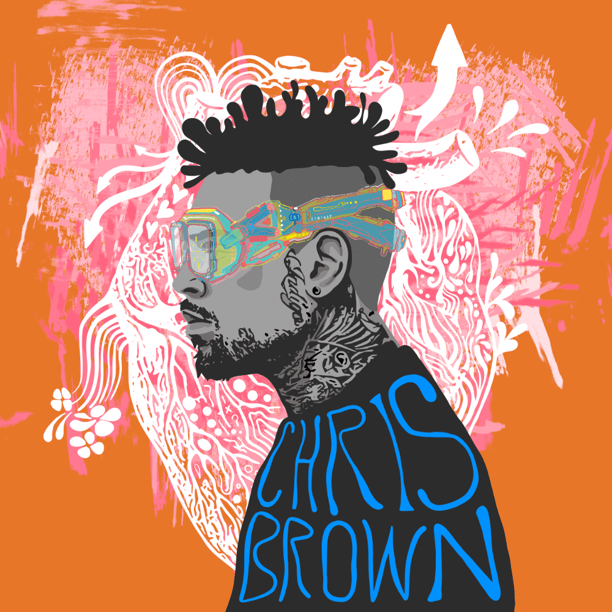

# Chris Brown Mintpang

全球首个去中心化音乐版权投资 NFT 项目🌠Chris Brown 和 Mintpang 启动了第一个去中心化音乐版权投资 NFT 项目。该项目为 Chris Brown 的新歌发行了 10,000 个基于 Klaytn 的 NFT，NFT 持有者（所有者）每月可以获得音乐收益 与现有的音乐版权投资平台不同的是，创作者的音乐版权分配给NFT持有者，而不是艺术家的股份。如果NFT持有者支持和推广艺术家，奖励将相应增加。 与您支持的艺术家一起，您可以建立一个同伴社区。

