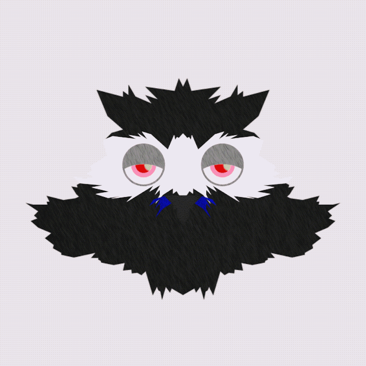
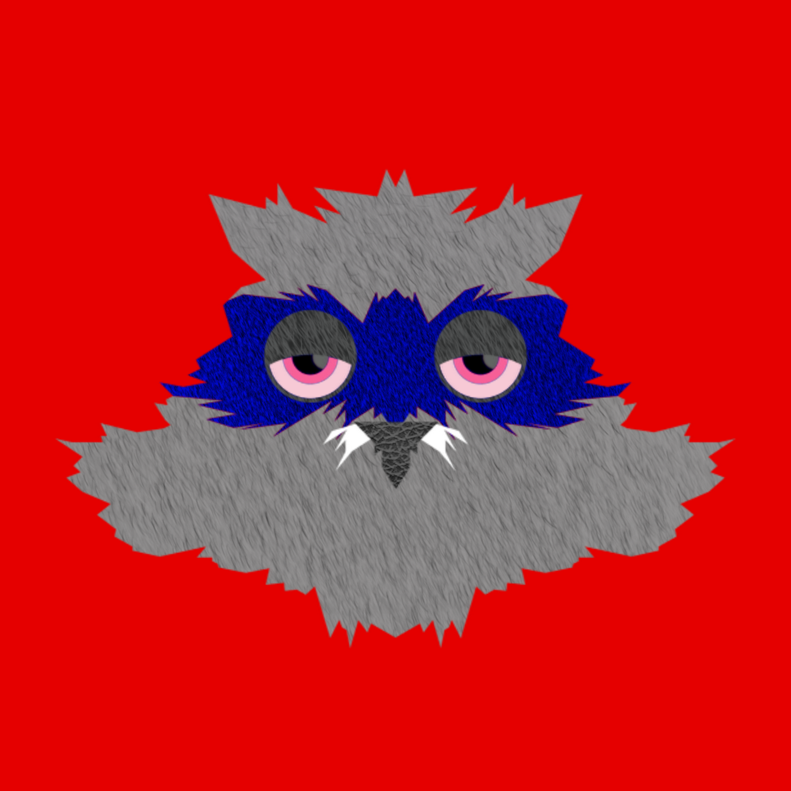
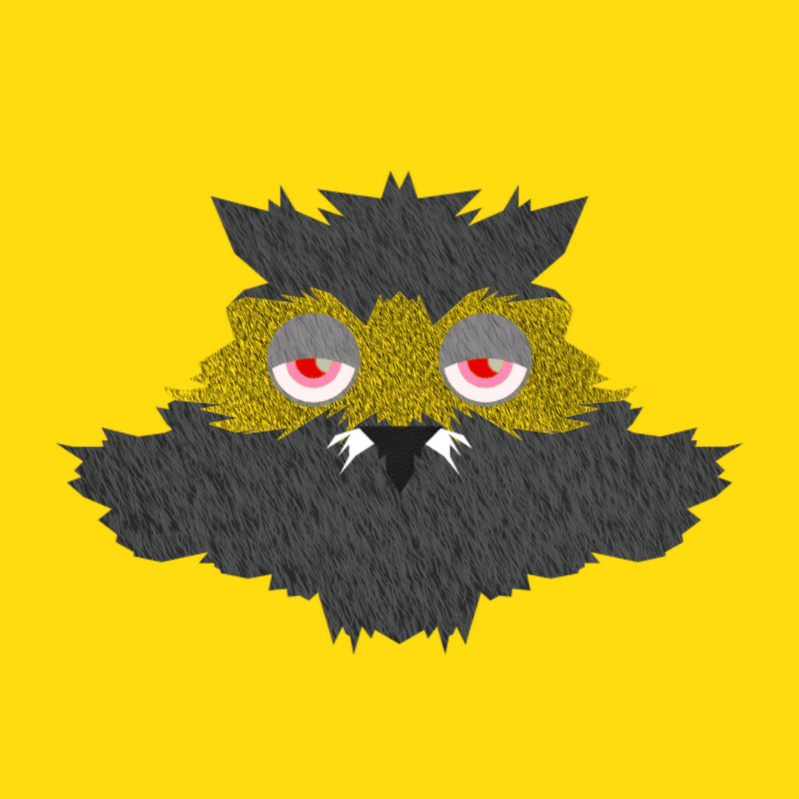

# Chroma Highcoon: 1st Gen

项目网站、社交联系方式、项目介绍内容详见：https://opensea.io/collection/chromahighcoon1stgen

 ighcoon 采用了 Chroma Sets: 1st Gen Collection 的颜色和氛围，创造了 420 种独特的变体。这个 NFT 的目的是让 Chroma Sets: 1st Gen NFT Collection 的所有者能够通过这个独特的 PFP 在 NFT 社区中识别自己。这也是 Highcoon 在区块链上的首次亮相，更多精彩还在后面。此 NFT 还将用作任何潜在的 Solo Highcoon 生成集合的白名单令牌。

