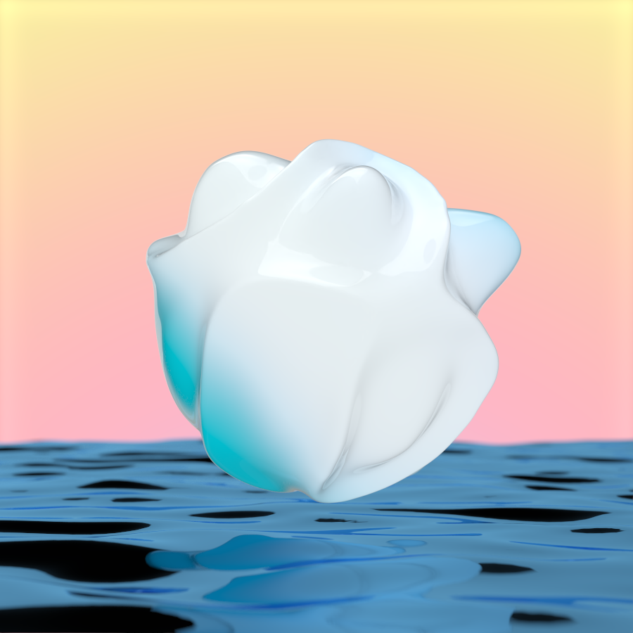
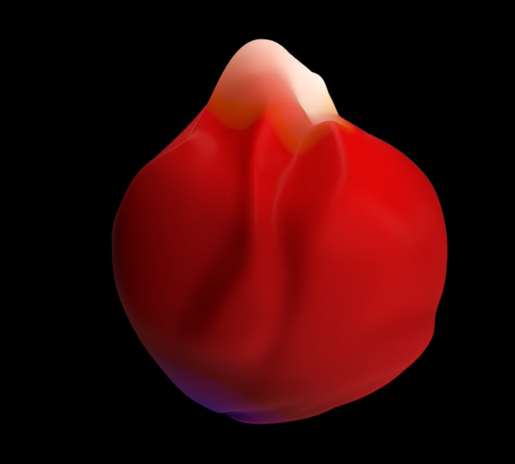
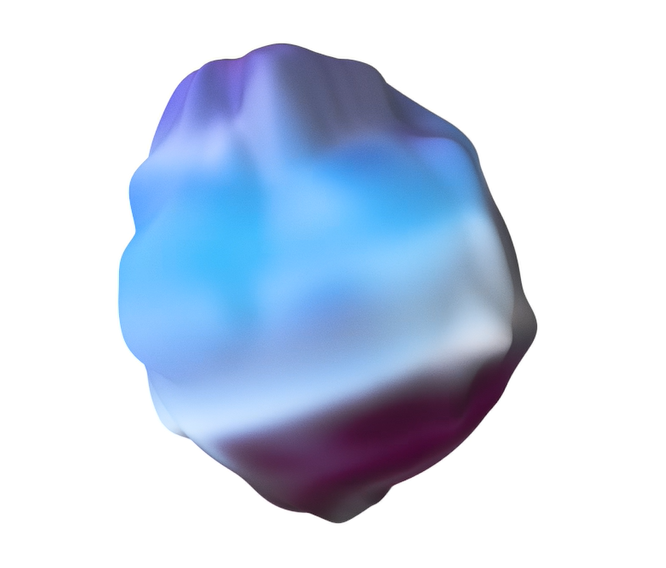

# Chromamorphs by Local Machine

项目网站、社交联系方式、项目介绍内容详见：https://opensea.io/collection/chromamorphsofficial

 [作为Autochroma](https://opensea.io/collection/autochroma)的继任者，Chromamorphs 代表了 Chroma 系列的下一个阶段。Autochroma 表达我们周围的能量，而 Chromamorphs 则捕捉我们内部的能量。

每个变形都从一个完美的球体开始。然后，根据每个变形的独特颜色特征，它们以一种独特的方式生长——移动、移动、跳舞和波动，然后返回到它们的原始状态。这种秩序和混乱、简单和深度、运动和休息的循环，使我们所知道的一切充满活力：色变体体现了生命的循环、颜色和形状。

Chromamorphs 是艺术家[本地机器](https://twitter.com/lclmachine)和[探戈](https://twitter.com/TangonanBradley)之间的合作。

