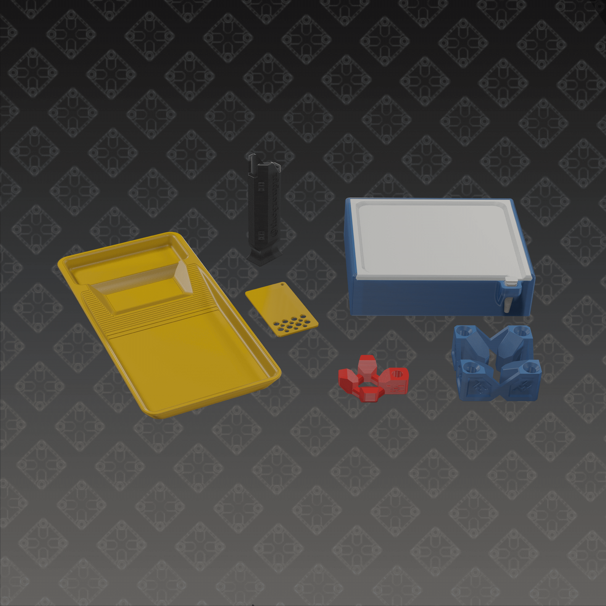
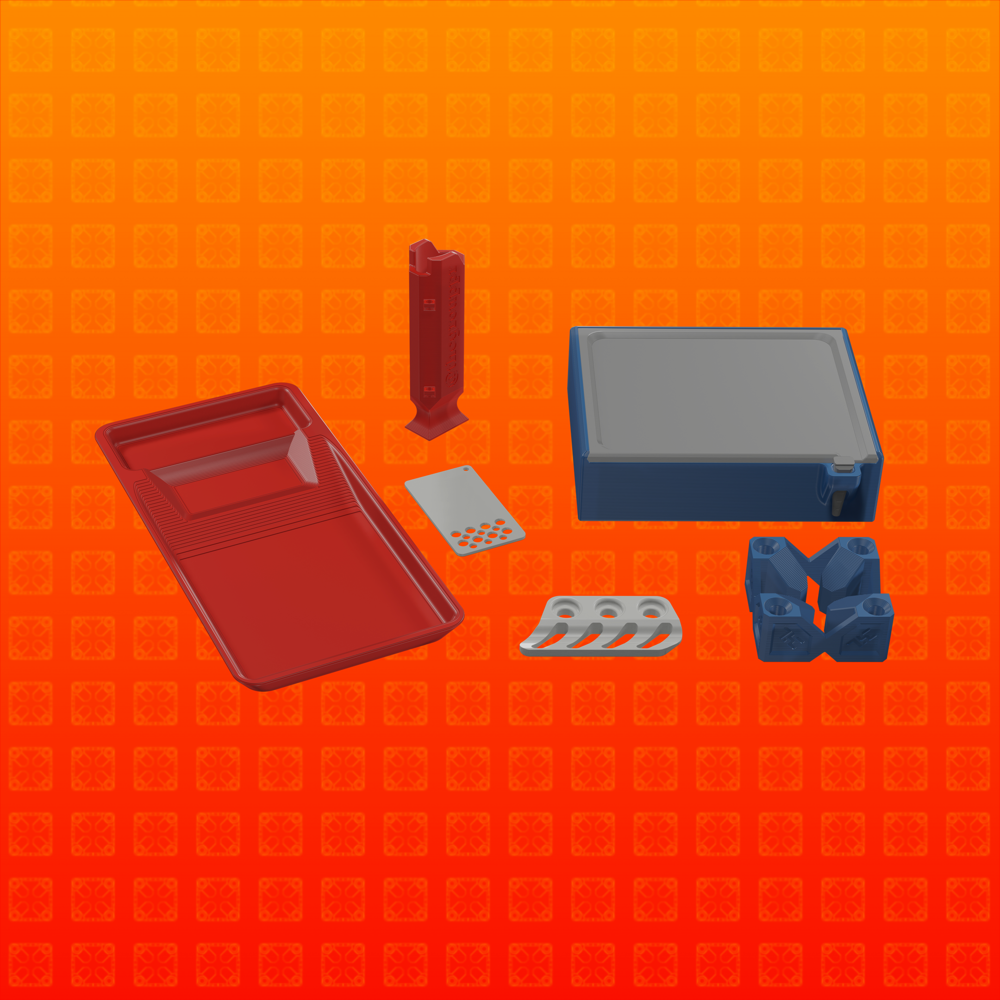
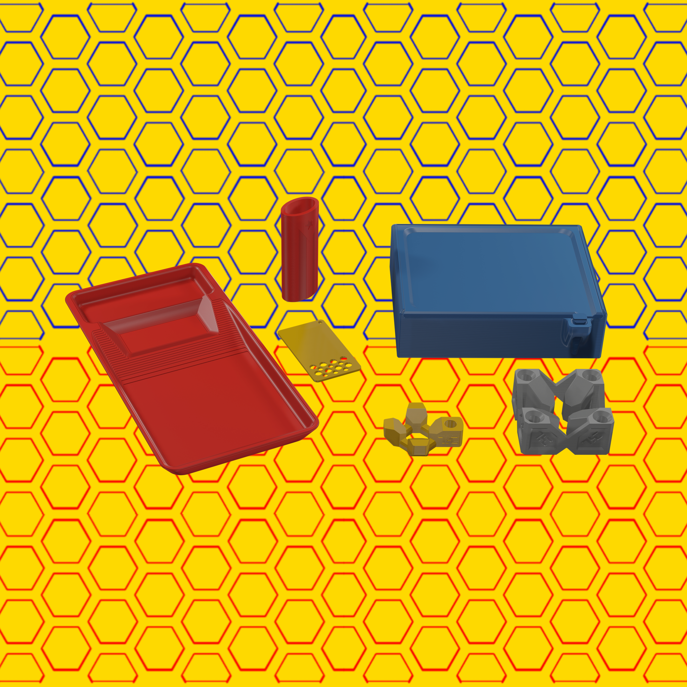

# Chroma Sets: 1st Gen

项目网站、社交联系方式、项目介绍内容详见：https://opensea.io/collection/chromasets1stgen

 Chroma Sets: 1st Gen 是 NFT 配件的集合，其设计和颜色各不相同，提供 78 个单独的特征来生成 420 1/1 Chroma Sets。有 7 个不同的类别，包括背景和配件，以及每个配件至少 6 种颜色变化。这个 NFT 收藏通过提供对收藏的 3D 资产以及配件的物理 :D 打印副本的访问，弥合了物理世界和数字世界之间的差距。快来加入一个专注于为消费者增加价值并通过合作和共同成长来改善他们的生活方式的创作者和品牌社区。

